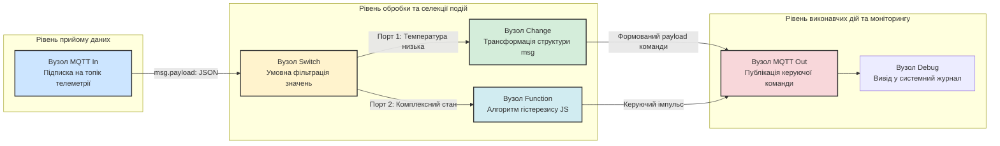
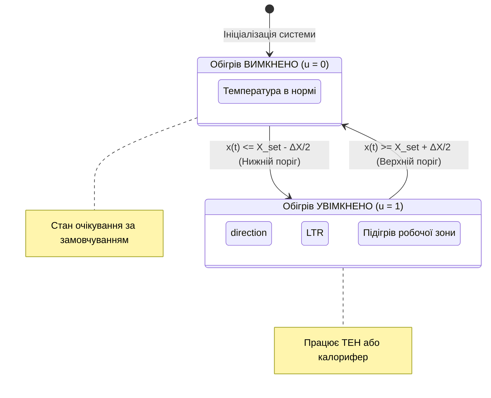
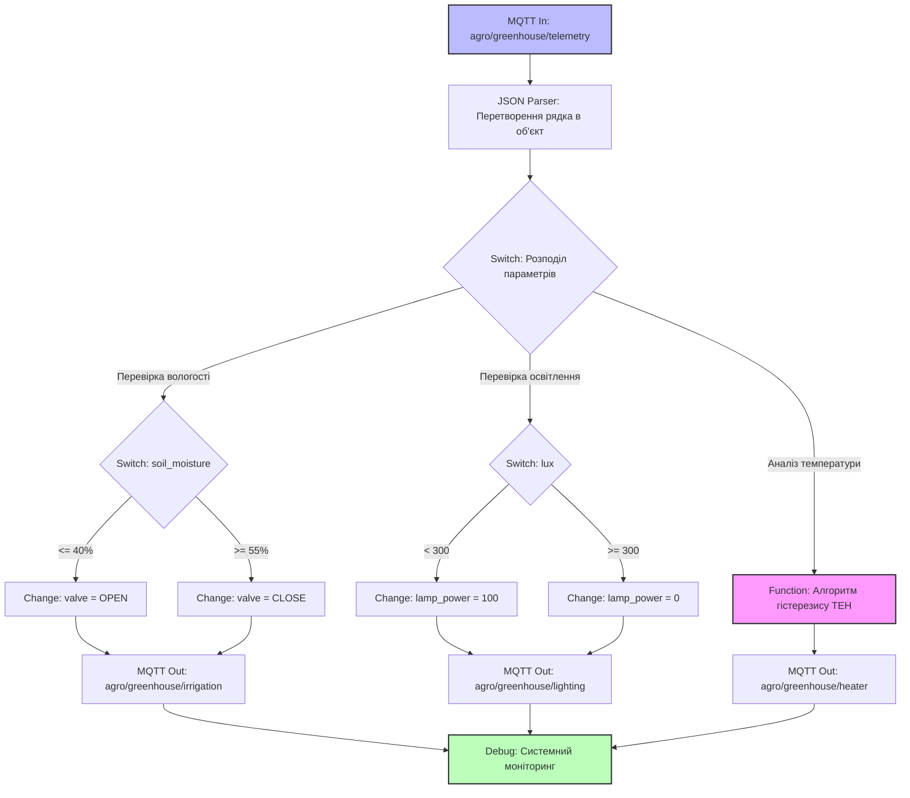

# Практичне заняття № 7. Складання логічних схем обробки подій та потоків даних для середовища Node-RED

**Мета:** Опанувати концепцію потокового програмування (Flow-Based Programming) у системах Інтернету речей, вивчити математичні та алгоритмічні моделі асинхронної обробки подій, а також набути практичних навичок формалізації технічного завдання, проєктування графів потоків даних (Node Graphs), налаштування вузлів селекції, перетворення даних і генерації виконуваних конфігурацій для середовища Node-RED.

**Стек технологій та інструменти:**
* **Мова програмування / Середовище:** JavaScript (ECMAScript 2022+), середовище виконання Node.js (версія 18.x LTS або 20.x LTS), графічна платформа оркестрації потоків Node-RED (версія 3.1+ або 4.x).
* **Платформа / Бібліотеки / Модулі:** Вбудовані вузли Node-RED (`node-red-node-mqtt`, `node-red-contrib-custom`), клієнтський інструментарій тестування протоколу MQTT (`mosquitto-clients`).
* **Інструменти розробки:** Вебінтерфейс редактора Node-RED Flow Editor, консоль/термінал операційної системи, середовище моделювання діаграм Draw.io або нотація Mermaid.

---

## 1 Теоретичні відомості

Парадигма потокового програмування (Flow-Based Programming, FBP) розглядає програмний застосунок як орієнтований граф, у якому вершинами виступають незалежні функціональні блоки (вузли або процеси), а ребрами — канали передавання повідомлень. У контексті Інтернету речей середовище Node-RED реалізує дану модель через асинхронну подієво-орієнтовану архітектуру (Event-Driven Architecture). Одиницею інформаційного обміну між вузлами є універсальний об'єкт повідомлення `msg`, обов'язковим атрибутом якого виступає поле корисного навантаження `msg.payload`, що містить дані телеметрії або команди керування у довільному форматі (найчастіше у вигляді серіалізованого об'єкта JSON).

Обробка подій у потокових мережах базується на теорії кінцевих автоматів (Finite State Machines, FSM) та механізмах фільтрації потоків даних у реальному часі (Complex Event Processing, CEP). Кожен вузол функціонує як ізольований «чорний ящик», який активується виключно в момент надходження вхідного повідомлення на його порт, виконує детерміноване перетворення над об'єктом `msg` та передає модифіковане повідомлення на один або кілька вихідних портів відповідно до закладених внутрішніх правил.


*Рисунок 1 — Граф потоку обробки подій у парадигмі Flow-Based Programming*

На рисунку 1 проілюстровано стандартний конвеєр обробки телеметрії. Вхідний вузол `MQTT In` приймає масив даних від польового контролера, перетворює бінарний потік у структурований JSON та спрямовує його до вузла селекції `Switch`. Вузол `Switch` аналізує числові атрибути повідомлення, розгалужуючи потік на кілька ізольованих гілок. Вузол `Change` виконує швидку декларативну модифікацію властивостей повідомлення (наприклад, записує нове значення в `msg.payload`), тоді як вузол `Function` реалізує складну алгоритмічну обробку мовою JavaScript. Фінальні команди передаються до актуаторів через вузол `MQTT Out` та паралельно фіксуються в журналі `Debug`.

У системах автоматичного регулювання мікроклімату для запобігання частим перемиканням актуаторів (явище «деренчання» або oscillation), які призводять до передчасного зносу реле та силових приводів, застосовують математичний апарат релейного регулювання з гістерезисом. Функція стану виконавчого пристрою $u(t)$ описується кусочно-неперервною залежністю:

$$u(t) = \begin{cases} 1, & \text{якщо } x(t) \le X_{\text{set}} - \frac{\Delta X}{2} \\ 0, & \text{якщо } x(t) \ge X_{\text{set}} + \frac{\Delta X}{2} \\ u(t - \Delta t), & \text{якщо } X_{\text{set}} - \frac{\Delta X}{2} < x(t) < X_{\text{set}} + \frac{\Delta X}{2} \end{cases}$$

де $u(t)$ — керуючий дискретний сигнал на виході алгоритму у поточний момент часу $t$, який набуває значення 1 (активовано) або 0 (деактивовано);  
$x(t)$ — поточне виміряне значення фізичного параметра з сенсора (наприклад, температура в $^\circ\text{C}$ або вологість у $\%$);  
$X_{\text{set}}$ — встановлене користувачем цільове значення регульованого параметра (Setpoint);  
$\Delta X$ — зона нечутливості або ширина петлі гістерезису (Hysteresis Band) у відповідних фізичних одиницях;  
$u(t - \Delta t)$ — значення керуючого сигналу на попередньому кроці квантування часу, що забезпечує збереження поточного стану всередині петлі гістерезису.


*Рисунок 2 — Скінченний автомат стану регулятора з зоною гістерезису*

Загальна затримка обробки повідомлення у розробленому потоці Node-RED ($T_{\text{flow}}$) визначається як сума часу перебування повідомлення в чергах обробки рушія Node.js та тривалості безпосереднього виконання коду в кожному вузлі:

$$T_{\text{flow}} = \sum_{i=1}^{N} \tau_{\text{exec}, i} + \sum_{j=1}^{N-1} \tau_{\text{queue}, j}$$

де $N$ — загальна кількість послідовно з'єднаних вузлів у ланцюгу обробки;  
$\tau_{\text{exec}, i}$ — час виконання інструкцій $i$-го функціонального вузла (с);  
$\tau_{\text{queue}, j}$ — затримка повідомлення в черзі мікротасок циклу подій (Event Loop) між вузлами $j$ та $j+1$ (с).

---

## 2 Підготовка середовища та розгортання проєкту (Крок 0)

Для підготовки робочого середовища необхідно перевірити наявність встановленого інтерпретатора Node.js, пакетного менеджера npm та розгорнути локальний екземпляр Node-RED.

1. Відкрийте термінал операційної системи та виконайте перевірку встановлених версій базових компонентів:

```bash
# Перевірка версії платформи Node.js (потрібна v18.0.0 або вище)
node --version

# Перевірка версії пакетного менеджера npm
npm --version

# Перевірка наявності встановленого глобального модуля Node-RED
node-red --version
```

2. Якщо Node-RED не встановлено, виконайте глобальну інсталяцію засобами npm:

```bash
# Встановлення стабільної версії Node-RED глобально в системі
npm install -g --unsafe-perm node-red
```

3. Створіть робочу директорію для файлів практичного заняття та перейдіть до неї:

```bash
mkdir -p ~/IoT_Practicals/PZ7_NodeRED_Flows/{flows,tests,docs}
cd ~/IoT_Practicals/PZ7_NodeRED_Flows
```

Структура файлів розробленого проєкту повинна мати такий вигляд:

```text
IoT_Practicals/PZ7_NodeRED_Flows/
├── flows/
│   └── greenhouse_flow.json      # Повна експортована конфігурація графа потоків Node-RED
├── tests/
│   ├── simulate_sensors.sh       # Bash-скрипт генерації тестових MQTT-повідомлень
│   └── test_payloads.json        # Набір еталонних вхідних векторів для перевірки логіки
└── docs/
    └── logic_diagram.png         # Експортована структурна схема алгоритму
```

4. Запустіть сервер Node-RED у фоновому або термінальному режимі за допомогою команди:

```bash
# Запуск локального сервера Node-RED на стандартному порту 1880
node-red
```

Після успішного старту сервера відкрийте веббраузер і перейдіть за адресою `http://127.0.0.1:1880`.

---

## 3 Порядок виконання роботи

### 3.1 Індивідуальні завдання

Кожен здобувач вищої освіти розробляє алгоритмічну блок-схему та відповідний потік обробки подій у середовищі Node-RED для системи автоматизації відповідно до індивідуального варіанта.

| Варіант | Назва системи / Об'єкт | Вхідні MQTT топіки та структура JSON | Порогові умови та логіка гістерезису | Вихідні MQTT топіки та команди |
| :---: | :--- | :--- | :--- | :--- |
| **1** | Розумна промислова теплиця | `greenhouse/sensors`<br/>`{"temp": 18.5, "humidity": 65}` | Обігрів: $T_{\text{set}} = 22^\circ\text{C}, \Delta T = 2^\circ\text{C}$. Якщо $T \le 21^\circ\text{C}$ — ON; якщо $T \ge 23^\circ\text{C}$ — OFF. | `greenhouse/relay/heater`<br/>`{"state": "ON" / "OFF"}` |
| **2** | Клімат серверної шафи | `datacenter/rack1/env`<br/>`{"temp": 29.0, "fan_rpm": 1200}` | Охолодження: $T_{\text{set}} = 24^\circ\text{C}, \Delta T = 4^\circ\text{C}$. Якщо $T \ge 26^\circ\text{C}$ — Fan MAX; якщо $T \le 22^\circ\text{C}$ — Fan ECO. | `datacenter/rack1/cooling`<br/>`{"mode": "MAX" / "ECO"}` |
| **3** | Сушарка зернового елеватора | `elevator/dryer/data`<br/>`{"grain_moist": 16.2, "t_air": 60}` | Продувка: якщо вологість зерна $> 14.5\%$ — пальники ON; якщо $\le 13.5\%$ — пальники OFF, охолодження ON. | `elevator/dryer/burners`<br/>`{"burners": 1 / 0, "blower": 1}` |
| **4** | Стерилізаційна автоклавна | `hospital/autoclave/stat`<br/>`{"pressure": 2.1, "temp": 121}` | Безпека: якщо тиск $> 2.4\text{ bar}$ або $T > 135^\circ\text{C}$ — аварійний скид; якщо тиск $< 1.8\text{ bar}$ — нагрів. | `hospital/autoclave/valve`<br/>`{"valve_open": true/false}` |
| **5** | Автоматичний інкубатор | `poultry/incubator/env`<br/>`{"temp": 37.2, "humidity": 52}` | Зволоження: якщо вологість $< 50\%$ — зволожувач ON; якщо $> 60\%$ — OFF. $T_{\text{set}} = 37.8^\circ\text{C}, \Delta T = 0.4^\circ\text{C}$. | `poultry/incubator/ctrl`<br/>`{"humidifier": 1, "heater": 1}` |
| **6** | Біореактор культивування | `biotech/reactor5/params`<br/>`{"ph": 6.8, "dissolved_o2": 18}` | Аерація: якщо $O_2 < 20\%$ — кисневий клапан OPEN; якщо $pH < 6.5$ — дозатор лугу START. | `biotech/reactor5/dosing`<br/>`{"o2_valve": 100, "base_pump": 1}` |
| **7** | Охолодження тягового двигуна | `transport/train/engine`<br/>`{"temp_stator": 92, "current": 340}` | Струмовий захист: якщо $T > 95^\circ\text{C}$ і струм $> 300\text{A}$ — знизити тягу на $50\%$; якщо $T < 70^\circ\text{C}$ — номінал. | `transport/train/traction`<br/>`{"power_limit": 50 / 100}` |
| **8** | Система водопідготовки басейну | `aquapark/pool2/water`<br/>`{"cl_free": 0.3, "turbidity": 4.2}` | Хлорування: якщо вільний $\text{Cl} < 0.5\text{ мг/л}$ — насос хлору ON; якщо каламутність $> 3.0\text{ NTU}$ — фільтр FLUSH. | `aquapark/pool2/pumps`<br/>`{"cl_dosing": 1, "filter_mode": 2}` |
| **9** | Овочесховище картоплі | `storage/potato/cell1`<br/>`{"co2_ppm": 1200, "temp": 4.5}` | Вентиляція: якщо $\text{CO}_2 > 1000\text{ ppm}$ — заслінки відкрити на $100\%$; підтримувати $T$ в межах $2.0 \dots 4.0^\circ\text{C}$. | `storage/potato/dampers`<br/>`{"position_pct": 100 / 20}` |
| **10** | Зарядний хаб електробусів | `chargehub/station4/status`<br/>`{"grid_load_kw": 140, "soc": 78}` | Балансування: якщо пікове навантаження мережі $> 130\text{ кВт}$ — струм заряду $32\text{A}$; інакше $128\text{A}$. | `chargehub/station4/pilot`<br/>`{"max_current": 32 / 128}` |
| **11** | Гідропонна установка зелені | `hydroponics/rack3/sensors`<br/>`{"ec_ms": 1.2, "water_temp": 19}` | Живильний розчин: якщо $\text{EC} < 1.6\text{ мСм/см}$ — додати концентрат A+B на 5 сек; $T_{\text{water}}$ тримати $18 \dots 20^\circ\text{C}$. | `hydroponics/rack3/pumps`<br/>`{"dose_pump_sec": 5, "chiller": 0}` |
| **12** | Фарбувальна камера СТО | `autocare/paint_booth/data`<br/>`{"voc_level": 450, "airflow": 0.8}` | Захист маляра: якщо леткі органічні сполуки $> 300\text{ мг/м}^3$ — аварійна витяжка ON, блокування дверей замком. | `autocare/paint_booth/safety`<br/>`{"exhaust_fan": 1, "door_lock": 1}` |
| **13** | Автономний сонячний інвертор | `energy/solar/inverter1`<br/>`{"v_bat": 46.8, "p_solar": 2400}` | Пріоритет живлення: якщо $V_{\text{bat}} < 47.0\text{V}$ — перемкнути лінію на міську мережу; якщо $> 52.0\text{V}$ — на сонце. | `energy/solar/grid_switch`<br/>`{"source": "GRID" / "SOLAR"}` |
| **14** | Склад фармацевтичних вакцин | `pharma/coldchain/box9`<br/>`{"temp": -18.2, "door_open": 0}` | Холодовий ланцюг: діапазон строго $-22 \dots -15^\circ\text{C}$. Якщо $T > -15^\circ\text{C}$ більше 60 сек — надсилати тривогу ALARM. | `pharma/coldchain/alarm`<br/>`{"alert_level": "CRITICAL"}` |
| **15** | ГНС (газорозподільний пункт)| `gas/station12/telemetry`<br/>`{"p_in": 12.0, "p_out": 0.35}` | Редукування: якщо вихідний тиск $> 0.4\text{ МПа}$ — відсічний клапан TRIP; якщо вхідний $< 6.0\text{ МПа}$ — попередити диспетчера. | `gas/station12/valves`<br/>`{"shutoff_valve": "CLOSED"}` |
| **16** | Розумна вулична дренажна помпа| `drainage/sector4/level`<br/>`{"water_level_cm": 85, "rain": 1}` | Відкачування: якщо рівень води $> 80\text{ см}$ — основна помпа ON; якщо $> 120\text{ см}$ — підключити резервну помпу. | `drainage/sector4/pumps`<br/>`{"pump_main": 1, "pump_aux": 1}` |
| **17** | Опалення шкільного спортзалу | `school/gym/climate`<br/>`{"temp": 15.0, "schedule_active": 1}` | Якщо розклад активний: підтримувати $T = 18^\circ\text{C}$ ($\Delta T = 1^\circ\text{C}$); у позаурочний час підтримувати $T = 12^\circ\text{C}$. | `school/gym/heating`<br/>`{"valve_pos": 75}` |
| **18** | Компресорна станція заводу | `factory/air/comp2`<br/>`{"press_bar": 6.2, "oil_temp": 78}` | Пневмомережа: тримати тиск $6.5 \dots 8.0\text{ бар}$. Якщо $P \le 6.5$ — Load; якщо $P \ge 8.0$ — Unload. Якщо $T_{\text{oil}} > 90$ — Stop. | `factory/air/comp2/cmd`<br/>`{"state": "LOAD" / "UNLOAD"}` |
| **19** | Капельна фільтрація вина | `winery/filtration/tank3`<br/>`{"diff_pressure": 1.8, "flow": 45}` | Забиття фільтра: якщо диференційний тиск $> 1.5\text{ бар}$ та потік $< 50\text{ л/год}$ — увімкнути цикл зворотної промивки. | `winery/filtration/wash`<br/>`{"backwash_cycle": true}` |
| **20** | Автоматична мийка вагонів | `railway/wash/track1`<br/>`{"train_pos_m": 12.5, "speed": 0.4}` | Якщо поїзд у зоні $10 \dots 50\text{ м}$ та швидкість $< 0.8\text{ м/с}$ — подати миючий розчин та обертати щітки. | `railway/wash/actuators`<br/>`{"brushes": 1, "chemical_pump": 1}` |

---

### 3.2 Покроковий алгоритм та розв'язок еталонного прикладу

Як еталонний приклад розглянемо проектування логіки для задачі **«Комплексний кліматичний контроль теплиці вирощування екзотичних рослин»**:
* Вхідний топік MQTT: `agro/greenhouse/telemetry`
* Вхідне повідомлення: JSON вигляду `{"temperature": 21.4, "soil_moisture": 38.0, "lux": 150}`
* Технічні вимоги:
  1. Підтримувати температуру повітря на рівні $24^\circ\text{C}$ за допомогою гістерезису шириною $\Delta T = 2^\circ\text{C}$ (ТЕН вмикається при $T \le 23^\circ\text{C}$, вимикається при $T \ge 25^\circ\text{C}$).
  2. Контролювати вологість ґрунту: якщо `soil_moisture` падає нижче $40\%$, сформувати команду відкриття клапана поливу на топік `agro/greenhouse/irrigation` зі значенням `{"valve": "OPEN"}`; якщо вологість перевищує $55\%$, надіслати команду `{"valve": "CLOSE"}`.
  3. Контролювати освітленість: якщо `lux` менше 300 люкс, активувати фітолампу (топік `agro/greenhouse/lighting`, значення `{"lamp_power": 100}`), інакше — вимкнути `{"lamp_power": 0}`.
  4. Усі керуючі команди дублювати у системний консольний лог з міткою часу.


*Рисунок 3 — Алгоритмічна структура потоку керування мікрокліматом теплиці*

#### Крок 1. Створення вузлів вхідного потоку та десеріалізації

1. Перетягніть із лівої палітри вузол **mqtt in** на робоче поле (Flow 1).
2. Двічі клацніть на вузол **mqtt in** та налаштуйте його параметри:
   * **Server:** виберіть локальний брокер або додайте новий (`127.0.0.1:1883`);
   * **Topic:** `agro/greenhouse/telemetry`;
   * **QoS:** `1`;
   * **Output:** `auto-detect (parsed JSON object)`.
   * **Name:** `Отримання телеметрії теплиці`.

#### Крок 2. Налаштування розгалуження та логіки для поливу і світла

1. Додайте вузол **switch** для аналізу параметра `msg.payload.soil_moisture`:
   * Правило 1: `<= 40` (вихід 1);
   * Правило 2: `>= 55` (вихід 2).
2. З'єднайте вихід 1 вузла **switch** із новим вузлом **change**:
   * Встановіть дію: `Set` `msg.payload` to `JSON` `{"valve": "OPEN", "reason": "LOW_MOISTURE"}`.
3. З'єднайте вихід 2 вузла **switch** із другим вузлом **change**:
   * Встановіть дію: `Set` `msg.payload` to `JSON` `{"valve": "CLOSE", "reason": "OPTIMAL_MOISTURE"}`.
4. Додайте вузол **mqtt out**, встановіть топік `agro/greenhouse/irrigation`, QoS `1`, Retain `true` та підключіть виходи обох блоків **change**.
5. Аналогічно додайте блок **switch** для аналізу `msg.payload.lux` з правилами `< 300` та `>= 300`, налаштуйте відповідні блоки **change** на відправку `{"lamp_power": 100}` і `{"lamp_power": 0}`, підключивши їх до вузла **mqtt out** із топіком `agro/greenhouse/lighting`.

#### Крок 3. Написання алгоритму гістерезису для нагрівача у вузлі Function

Для реалізації релейного регулятора з пам'яттю стану скористаємося контекстним сховищем вузла (`context.get` / `context.set`), що дозволяє зберігати поточний стан між ітераціями надходження повідомлень.

Додайте вузол **function** з назвою `Гістерезис ТЕН` та введіть повний виконуваний код мовою JavaScript:

```javascript
// =====================================================================
// АЛГОРИТМ РЕЛЕЙНОГО РЕГУЛЮВАННЯ ТЕМПЕРАТУРИ З ГІСТЕРЕЗИСОМ
// =====================================================================

// 1. Зчитування цільових констант регулювання
const T_SET = 24.0;         // Базова цільова уставка температури (°C)
const DELTA_T = 2.0;       // Ширина петлі гістерезису (°C)
const T_LOW = T_SET - (DELTA_T / 2.0);   // Нижній поріг увімкнення: 23.0 °C
const T_HIGH = T_SET + (DELTA_T / 2.0);  // Верхній поріг вимкнення: 25.0 °C

// 2. Отримання поточного стану нагрівача з енергонезалежного контексту вузла
// За замовчуванням при першому запуску стан вважається вимкненим (OFF)
let currentState = context.get('heater_state') || 'OFF';

// 3. Валідація вхідного значення температури
if (msg.payload === undefined || msg.payload.temperature === undefined) {
    node.warn("Отримано некоректний пакет: відсутнє поле msg.payload.temperature");
    return null; // Припинення обробки некоректного повідомлення
}

let currentTemp = Number(msg.payload.temperature);

// 4. Логіка автомата станів з урахуванням зони нечутливості
let stateChanged = false;

if (currentTemp <= T_LOW && currentState !== 'ON') {
    currentState = 'ON';
    stateChanged = true;
    node.status({fill: "red", shape: "dot", text: "Обігрів: УВІМКНЕНО (" + currentTemp + "°C)"});
} else if (currentTemp >= T_HIGH && currentState !== 'OFF') {
    currentState = 'OFF';
    stateChanged = true;
    node.status({fill: "grey", shape: "ring", text: "Обігрів: ВИМКНЕНО (" + currentTemp + "°C)"});
} else {
    // Температура всередині петлі гістерезису (T_LOW < T < T_HIGH) — стан не змінюється
    node.status({
        fill: currentState === 'ON' ? "red" : "grey",
        shape: currentState === 'ON' ? "dot" : "ring",
        text: "Стабільний стан: " + currentState + " (" + currentTemp + "°C)"
    });
}

// 5. Оновлення збереженого стану в контексті
context.set('heater_state', currentState);

// 6. Формування вихідного повідомлення лише у разі фактичної зміни стану
if (stateChanged) {
    let outMsg = {
        topic: "agro/greenhouse/heater",
        payload: {
            state: currentState,
            current_temperature: currentTemp,
            setpoint: T_SET,
            timestamp: new Date().toISOString()
        },
        qos: 1,
        retain: true
    };
    return outMsg;
}

// Якщо стан не змінився — повідомлення на вихід не надсилається для економії трафіку
return null;
```

#### Крок 4. Повний еталонний JSON-маніфест для імпорту в Node-RED

Для імпорту готової конфігурації у Node-RED натисніть комбінацію клавіш `Ctrl+I` (або виберіть *Меню* $\to$ *Import*), вставте наведений нижче JSON-код та натисніть кнопку **Import**:

```json
[
    {
        "id": "tab_greenhouse_ctrl",
        "type": "tab",
        "label": "Greenhouse Automation",
        "disabled": false,
        "info": "Практичне заняття 7: Еталонний потік клімат-контролю теплиці"
    },
    {
        "id": "mqtt_broker_local",
        "type": "mqtt-broker",
        "name": "Local Mosquitto",
        "broker": "127.0.0.1",
        "port": "1883",
        "clientid": "NodeRED_Core_Engine",
        "autoConnect": true,
        "usetls": false,
        "compatmode": false,
        "keepalive": "60",
        "cleansession": true
    },
    {
        "id": "node_mqtt_in_telemetry",
        "type": "mqtt in",
        "z": "tab_greenhouse_ctrl",
        "name": "Telemetry In",
        "topic": "agro/greenhouse/telemetry",
        "qos": "1",
        "datatype": "json",
        "broker": "mqtt_broker_local",
        "nl": false,
        "rap": true,
        "rh": 0,
        "x": 140,
        "y": 180,
        "wires": [
            [
                "node_switch_moist",
                "node_switch_lux",
                "node_func_hysteresis"
            ]
        ]
    },
    {
        "id": "node_switch_moist",
        "type": "switch",
        "z": "tab_greenhouse_ctrl",
        "name": "Moisture Decision",
        "property": "payload.soil_moisture",
        "propertyType": "msg",
        "rules": [
            {
                "t": "lte",
                "v": "40",
                "vt": "num"
            },
            {
                "t": "gte",
                "v": "55",
                "vt": "num"
            }
        ],
        "checkall": "true",
        "repair": false,
        "outputs": 2,
        "x": 410,
        "y": 100,
        "wires": [
            [
                "node_change_valve_on"
            ],
            [
                "node_change_valve_off"
            ]
        ]
    },
    {
        "id": "node_change_valve_on",
        "type": "change",
        "z": "tab_greenhouse_ctrl",
        "name": "Valve OPEN",
        "rules": [
            {
                "t": "set",
                "p": "payload",
                "pt": "msg",
                "to": "{\"valve\":\"OPEN\",\"mode\":\"AUTO\"}",
                "tot": "json"
            }
        ],
        "action": "",
        "property": "",
        "from": "",
        "to": "",
        "reg": false,
        "x": 650,
        "y": 80,
        "wires": [
            [
                "node_mqtt_out_irrigation"
            ]
        ]
    },
    {
        "id": "node_change_valve_off",
        "type": "change",
        "z": "tab_greenhouse_ctrl",
        "name": "Valve CLOSE",
        "rules": [
            {
                "t": "set",
                "p": "payload",
                "pt": "msg",
                "to": "{\"valve\":\"CLOSE\",\"mode\":\"AUTO\"}",
                "tot": "json"
            }
        ],
        "action": "",
        "property": "",
        "from": "",
        "to": "",
        "reg": false,
        "x": 660,
        "y": 120,
        "wires": [
            [
                "node_mqtt_out_irrigation"
            ]
        ]
    },
    {
        "id": "node_switch_lux",
        "type": "switch",
        "z": "tab_greenhouse_ctrl",
        "name": "Lux Decision",
        "property": "payload.lux",
        "propertyType": "msg",
        "rules": [
            {
                "t": "lt",
                "v": "300",
                "vt": "num"
            },
            {
                "t": "gte",
                "v": "300",
                "vt": "num"
            }
        ],
        "checkall": "true",
        "repair": false,
        "outputs": 2,
        "x": 390,
        "y": 260,
        "wires": [
            [
                "node_change_light_on"
            ],
            [
                "node_change_light_off"
            ]
        ]
    },
    {
        "id": "node_change_light_on",
        "type": "change",
        "z": "tab_greenhouse_ctrl",
        "name": "Light ON",
        "rules": [
            {
                "t": "set",
                "p": "payload",
                "pt": "msg",
                "to": "{\"lamp_power\":100}",
                "tot": "json"
            }
        ],
        "action": "",
        "property": "",
        "from": "",
        "to": "",
        "reg": false,
        "x": 640,
        "y": 240,
        "wires": [
            [
                "node_mqtt_out_light"
            ]
        ]
    },
    {
        "id": "node_change_light_off",
        "type": "change",
        "z": "tab_greenhouse_ctrl",
        "name": "Light OFF",
        "rules": [
            {
                "t": "set",
                "p": "payload",
                "pt": "msg",
                "to": "{\"lamp_power\":0}",
                "tot": "json"
            }
        ],
        "action": "",
        "property": "",
        "from": "",
        "to": "",
        "reg": false,
        "x": 640,
        "y": 280,
        "wires": [
            [
                "node_mqtt_out_light"
            ]
        ]
    },
    {
        "id": "node_func_hysteresis",
        "type": "function",
        "z": "tab_greenhouse_ctrl",
        "name": "Гістерезис ТЕН",
        "func": "const T_SET = 24.0;\nconst DELTA_T = 2.0;\nconst T_LOW = T_SET - (DELTA_T / 2.0);\nconst T_HIGH = T_SET + (DELTA_T / 2.0);\n\nlet currentState = context.get('heater_state') || 'OFF';\n\nif (!msg.payload || msg.payload.temperature === undefined) {\n    node.warn(\"Некоректний формат температури\");\n    return null;\n}\n\nlet currentTemp = Number(msg.payload.temperature);\nlet stateChanged = false;\n\nif (currentTemp <= T_LOW && currentState !== 'ON') {\n    currentState = 'ON';\n    stateChanged = true;\n} else if (currentTemp >= T_HIGH && currentState !== 'OFF') {\n    currentState = 'OFF';\n    stateChanged = true;\n}\n\ncontext.set('heater_state', currentState);\n\nif (stateChanged) {\n    return {\n        topic: \"agro/greenhouse/heater\",\n        payload: {\n            state: currentState,\n            current_temperature: currentTemp,\n            setpoint: T_SET,\n            timestamp: new Date().toISOString()\n        },\n        qos: 1,\n        retain: true\n    };\n}\nreturn null;",
        "outputs": 1,
        "noerr": 0,
        "initialize": "",
        "finalize": "",
        "libs": [],
        "x": 420,
        "y": 180,
        "wires": [
            [
                "node_mqtt_out_heater"
            ]
        ]
    },
    {
        "id": "node_mqtt_out_irrigation",
        "type": "mqtt out",
        "z": "tab_greenhouse_ctrl",
        "name": "Irrigation Command",
        "topic": "agro/greenhouse/irrigation",
        "qos": "1",
        "retain": "true",
        "respTopic": "",
        "contentType": "",
        "userProps": "",
        "correl": "",
        "expiry": "",
        "broker": "mqtt_broker_local",
        "x": 920,
        "y": 100,
        "wires": []
    },
    {
        "id": "node_mqtt_out_light",
        "type": "mqtt out",
        "z": "tab_greenhouse_ctrl",
        "name": "Lighting Command",
        "topic": "agro/greenhouse/lighting",
        "qos": "1",
        "retain": "true",
        "respTopic": "",
        "contentType": "",
        "userProps": "",
        "correl": "",
        "expiry": "",
        "broker": "mqtt_broker_local",
        "x": 910,
        "y": 260,
        "wires": []
    },
    {
        "id": "node_mqtt_out_heater",
        "type": "mqtt out",
        "z": "tab_greenhouse_ctrl",
        "name": "Heater Command",
        "topic": "agro/greenhouse/heater",
        "qos": "1",
        "retain": "true",
        "respTopic": "",
        "contentType": "",
        "userProps": "",
        "correl": "",
        "expiry": "",
        "broker": "mqtt_broker_local",
        "x": 910,
        "y": 180,
        "wires": []
    },
    {
        "id": "node_debug_trace",
        "type": "debug",
        "z": "tab_greenhouse_ctrl",
        "name": "System Audit Log",
        "active": true,
        "tosidebar": true,
        "console": true,
        "tostatus": false,
        "complete": "true",
        "targetType": "full",
        "statusVal": "",
        "statusType": "auto",
        "x": 910,
        "y": 340,
        "wires": []
    }
]
```

5. Натисніть червону кнопку **Deploy** у правому верхньому кутку робочого вікна для компіляції та запуску потоку на виконуючому рушії.

---

### 3.3 Запуск, тестування та перевірка результатів

Для перевірки коректності функціонування розробленого графа потоків відкрийте два окремих термінальних вікна: у першому запустіть утиліту прослуховування топіків `mosquitto_sub`, а у другому надсилайте тестові пакети за допомогою `mosquitto_pub`.

1. Запустіть моніторинг усіх вихідних топіків системи в окремому терміналі:

```bash
# Підписка на всі підтопіки теплиці за допомогою символу підстановки #
mosquitto_sub -h 127.0.0.1 -p 1883 -t "agro/greenhouse/#" -v
```

2. Виконайте послідовне надсилання тестових тестових наборів даних у топік телеметрії:

```bash
# Тест 1: Знижена температура (21.5°C), низька вологість (35%), слабке світло (120 lx)
mosquitto_pub -h 127.0.0.1 -p 1883 -t "agro/greenhouse/telemetry" -m '{"temperature": 21.5, "soil_moisture": 35.0, "lux": 120}'

# Тест 2: Температура всередині петлі гістерезису (23.8°C) — ТЕН повинен залишитися ON
mosquitto_pub -h 127.0.0.1 -p 1883 -t "agro/greenhouse/telemetry" -m '{"temperature": 23.8, "soil_moisture": 48.0, "lux": 450}'

# Тест 3: Температура перевищила верхній поріг (25.4°C), вологість достатня (58%)
mosquitto_pub -h 127.0.0.1 -p 1883 -t "agro/greenhouse/telemetry" -m '{"temperature": 25.4, "soil_moisture": 58.0, "lux": 600}'
```

#### Еталонний результат виведення в консолі `mosquitto_sub`:

```text
agro/greenhouse/telemetry {"temperature": 21.5, "soil_moisture": 35.0, "lux": 120}
agro/greenhouse/irrigation {"valve":"OPEN","mode":"AUTO"}
agro/greenhouse/lighting {"lamp_power":100}
agro/greenhouse/heater {"state":"ON","current_temperature":21.5,"setpoint":24,"timestamp":"2026-08-26T14:15:02.104Z"}

agro/greenhouse/telemetry {"temperature": 23.8, "soil_moisture": 48.0, "lux": 450}
agro/greenhouse/lighting {"lamp_power":0}

agro/greenhouse/telemetry {"temperature": 25.4, "soil_moisture": 58.0, "lux": 600}
agro/greenhouse/irrigation {"valve":"CLOSE","mode":"AUTO"}
agro/greenhouse/heater {"state":"OFF","current_temperature":25.4,"setpoint":24,"timestamp":"2026-08-26T14:15:15.820Z"}
```

#### Приклад відображення записів у панелі Debug вікна Node-RED:

```text
[26.08.2026, 17:15:02] node: System Audit Log
agro/greenhouse/heater : msg : Object
{
  topic: "agro/greenhouse/heater",
  payload: {
    state: "ON",
    current_temperature: 21.5,
    setpoint: 24,
    timestamp: "2026-08-26T14:15:02.104Z"
  },
  qos: 1,
  retain: true,
  _msgid: "6c7d23a1.9f123c"
}
```

Аналіз отриманих результатів підтверджує: при температурі $21.5^\circ\text{C}$ ТЕН активувався (`state: "ON"`). При підвищенні температури до $23.8^\circ\text{C}$ стан нагрівача не змінився, а нове повідомлення в топік `heater` не публікувалося. При досягненні $25.4^\circ\text{C}$ обігрів деактивувався (`state: "OFF"`).

---

## 4 Вимоги до змісту звіту

Звіт оформлюється українською мовою на аркушах формату А4 відповідно до стандарту ДСТУ 3008:2015 і повинен містити такі розділи:

1. **Титульна сторінка** із зазначенням назви Міністерства освіти і науки України, назви університету, кафедри, дисципліни, номера практичного заняття, теми роботи, номера навчальної групи, прізвища та ініціалів здобувача й викладача.
2. **Мета роботи** та теоретичний опис обраної технології потокової обробки подій.
3. **Постановка індивідуального завдання** для закріпленого варіанта з таблиці 3.1: опис системи, перелік топіків, формат JSON та математичні межі спрацювання регуляторів.
4. **Алгоритмічна блок-схема потоку** (створена у нотації UML або Mermaid) із відображенням напрямків руху повідомлень між вузлами.
5. **Повний вихідний код функціональних вузлів (Function Nodes)** мовою JavaScript із детальним коментарем кожного рядка програми.
6. **Експортований JSON-маніфест** розробленого графа потоків (Flow JSON).
7. **Результати тестування:** скріншоти робочого поля Node-RED зі статусами вузлів, скріншоти панелі налагодження (Debug sidebar) та логи з термінала `mosquitto_sub` для трьох характерних режимів роботи (нижче норми, норма, вище норми).
8. **Аналітичні висновки**, у яких оцінено надійність роботи розробленого автомата станів, проаналізовано затримки обробки та обґрунтовано вибір ширини зони гістерезису.

---

## 5 Контрольні запитання для захисту роботи

1. **У чому полягає фундаментальна відмінність між парадигмою Flow-Based Programming (FBP) та класичним процедурним або об'єктно-орієнтованим підходом до обробки даних?** Поясніть роль об'єкта `msg` як базового контейнера стану.
2. **Чому для релейного керування виконавчими пристроями в ІоТ обов'язковим є застосування зони нечутливості (гістерезису)?** Які наслідки для апаратного забезпечення матиме відсутність гістерезису при коливаннях показів датчика на межі порогового значення?
3. **Яким чином у середовищі Node-RED організовано збереження внутрішнього стану змінних між окремими викликами вузла Function?** Поясніть різницю між контекстами `context`, `flow` та `global`.
4. **Яке призначення мають атрибути `QoS` (Quality of Service) та `Retain` у вузлах `mqtt in` та `mqtt out`?** У яких випадках прапорець Retain є критично важливим для актуаторів?
5. **Як впливає велика кількість вузлів типу Function із важкими обчисленнями на загальну швидкодію Node-RED?** Поясніть поведінку циклу подій (Event Loop) у середовищі Node.js при блокуючих синхронних операціях.
6. **Опишіть порядок валідації вхідних даних у вузлах Switch.** Яким чином обробляється ситуація, коли у вхідному JSON-пакеті взагалі відсутнє поле, за яким виконується перевірка умови?