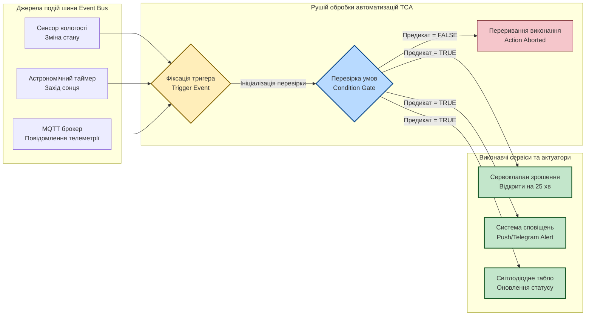
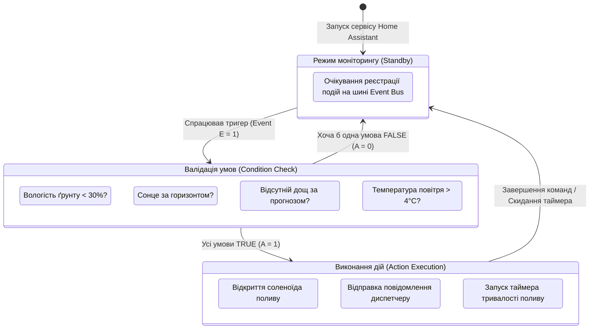
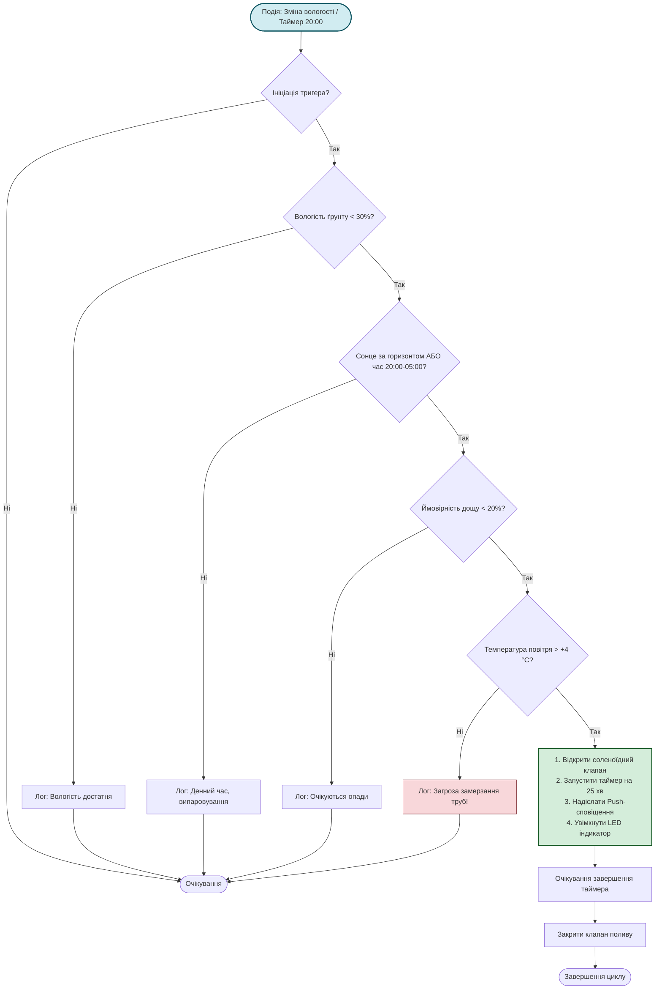

# Практичне заняття № 8. Розробка комплексних сценаріїв автоматизації для Smart Home та Smart Factory у форматі Trigger-Condition-Action

**Мета:** Опанувати концепцію подієво-орієнтованого керування (Event-Driven Control) у системах Інтернету речей, вивчити математичний апарат алгебри логіки та предикатів для формалізації багатокритеріальних правил, набути практичних навичок проєктування сценаріїв автоматизації у парадигмі Trigger-Condition-Action (TCA), а також розробити, верифікувати та протестувати виконувані конфігураційні файли автоматизацій у форматі YAML для платформи Home Assistant.

**Стек технологій та інструменти:**
* **Мова опису та шаблонізації:** Структурована мова розмітки даних YAML (специфікація 1.2), декларативний рушій автоматизацій Home Assistant Automation Schema, мова шаблонів Jinja2 для обчислення динамічних предикатів.
* **Середовище виконання та тестування:** Платформа автоматизації Home Assistant Core (версія 2024.x або 2026.x), інтерпретатор Python (версія 3.11 або вище) для симуляції подій та синтаксичної валідації.
* **Інструменти розробки:** Редактор вихідного коду Visual Studio Code із розширеннями YAML Linter та Home Assistant Config Helper, термінал командного рядка (CLI).

---

## 1 Теоретичні відомості

Архітектура сучасних платформ інтелектуального будинку (Smart Home) та промислової автоматизації (Smart Factory) ґрунтується на концепції диспетчеризації повідомлень за подійною моделлю. У центрі системи функціонує шина подій (Event Bus), яка фіксує будь-які зміни фізичного стану датчиків, надходження мережевих пакетів, спрацьовування таймерів або дії користувачів. Для перетворення хаотичного потоку асинхронних подій у детерміновані керуючі впливи застосовується парадигма **Trigger - Condition - Action (TCA)**.

Парадигма TCA складається з трьох послідовних фаз обробки інформації:

1. **Тригер (Trigger)** виступає подією-ініціатором, яка пробуджує сценарій автоматизації від стану очікування. Тригери мають точковий у часі характер і спрацьовують за фронтом зміни сигналу (наприклад, перетин порогового значення температури, зміна числового статусу або настання астрономічної події заходу сонця).
2. **Умова (Condition)** представляє собою логічний фільтр (предикат), який перевіряє стан системи безпосередньо в момент спрацьовування тригера. На відміну від тригера, умова аналізує тривалий стан середовища. Якщо умова оцінюється як хибна (`false`), подальше виконання сценарію негайно переривається.
3. **Дія (Action)** визначає послідовність виклику служб (Service Calls) або надсилання керуючих команд на актуатори, якщо всі зазначені умови були успішно виконані.


*Рисунок 1 — Послідовність проходження керуючого сигналу в архітектурі Trigger-Condition-Action*

На рисунку 1 наведено загальну схему виконання автоматизації: зміна параметрів на шині генерує тригер, після чого блок умов оцінює комбінацію вхідних факторів. Лише при отриманні позитивного логічного висновку сигнал передається до кінцевих актуаторів.

Математично роботу блоку прийняття рішень можна формалізувати за допомогою апарату алгебри логіки (булевої алгебри). Нехай $E(t) \in \{0, 1\}$ — булева функція фіксації події тригера у дискретний момент часу $t$, а $C_i(t) \in \{0, 1\}$ — множина з $k$ логічних предикатів, що відповідають поточним умовам функціонування системи. Тоді результуючий сигнал активації дії $A(t)$ записується у вигляді кон'юнкції:

$$A(t) = E(t) \wedge \left( \bigwedge_{i=1}^{k} C_i(t) \right) = E(t) \wedge \left( C_1(t) \wedge C_2(t) \wedge \dots \wedge C_k(t) \right)$$

де $A(t) = 1$ ініціює запуск блоку дій $\mathcal{A} = \{a_1, a_2, \dots, a_m\}$, а $A(t) = 0$ блокує виконання.

Якщо система вимагає врахування альтернативних сценаріїв або заборонних факторів, складена функція умов подається у довільній диз'юнктивно-кон'юнктивній формі:

$$A(t) = E(t) \wedge \left( \left( \bigvee_{j=1}^{p} C_{A, j}(t) \right) \wedge \neg C_{\text{inhibit}}(t) \right)$$

де $C_{A, j}(t)$ — набір альтернативних дозволяючих умов (об'єднаних логічним «АБО»);  
$C_{\text{inhibit}}(t)$ — блокуюча умова (наприклад, активний сигнал аварійної зупинки або виявлений прогноз сильного дощу), наявність якої примусово вимикає виконання дій.

Для оцінки надійності спрацьовування комплексного правила в умовах можливих спотворень або затримок надходження даних від окремих сенсорів застосовують розрахунок сукупної ймовірності коректної дії $P(A)$:

$$P(A) = P(E) \cdot \prod_{i=1}^{k} \left(1 - p_{\text{err}, i}\right)$$

де $P(E)$ — ймовірність своєчасної та безпомилкової фіксації події тригера;  
$p_{\text{err}, i}$ — ймовірність виникнення апаратної або комунікаційної помилки при зчитуванні стану $i$-го сенсора, що бере участь у формуванні предикатів умов.


*Рисунок 2 — Діаграма станів скінченного автомата автоматизованого керування*

На рисунку 2 проілюстровано повний життєвий цикл роботи автоматизації: перехід від стану пасивного моніторингу через послідовні шлюзи перевірки фізичних параметрів до стану безпосереднього впливу на об'єкт керування.

---

## 2 Підготовка середовища та розгортання проєкту (Крок 0)

Для виконання практичних розрахунків, створення YAML-сценаріїв та їх тестування використовується локальне середовище на базі Python та засобів синтаксичного аналізу.

1. Відкрийте термінал операційної системи та виконайте перевірку наявності встановленого інтерпретатора Python і пакета керування залежностями `pip`:

```bash
# Перевірка версії середовища Python
python3 --version

# Перевірка наявності та працездатності менеджера пакетів pip
pip3 --version
```

2. Встановіть спеціалізовані бібліотеки для валідації синтаксису YAML та моделювання подієвих систем:

```bash
# Встановлення утиліти перевірки коректності структури YAML-файлів
pip3 install yamllint pyyaml
```

3. Створіть структуру папок проєкту для збереження сценаріїв, валідаторів та тестових логів:

```bash
# Створення робочих каталогів проєкту
mkdir -p ~/IoT_Practicals/PZ8_Automations/{automations,validators,tests,docs}
cd ~/IoT_Practicals/PZ8_Automations
```

Структура каталогу проєкту повинна мати такий вигляд:

```text
PZ8_Automations/
├── automations/
│   └── smart_irrigation.yaml     # Готовий файл автоматизації у форматі Home Assistant YAML
├── validators/
│   └── schema_validator.py       # Python-скрипт для синтаксичної та логічної верифікації
├── tests/
│   └── run_simulation.py         # Емулятор подієвої шини та тестування граничних умов
└── docs/
    └── automation_scheme.png     # Графічна блок-схема розробленого алгоритму
```

4. Створіть файл конфігурації лінтера `.yamllint` у корені проєкту для контролю стандартів відступів:

```yaml
---
rules:
  line-length:
    max: 120
    level: warning
  indentation:
    spaces: 2
    indent-sequences: true
  document-start: disable
```

---

## 3 Порядок виконання роботи

### 3.1 Індивідуальні завдання

Кожен здобувач вищої освіти розробляє алгоритмічну блок-схему, математичну формулу логічного предикату та повний конфігураційний файл автоматизації у форматі Home Assistant YAML відповідно до свого індивідуального варіанта.

| Варіант | Назва системи / Об'єкт | Тригери подій (Triggers) | Складні комплексні умови (Conditions) | Виконавчі дії (Actions) та сервіси |
| :---: | :--- | :--- | :--- | :--- |
| **1** | Автоматизація теплиці | Зміна вологості ґрунту або настання 20:00 | Вологість ґрунту $< 30\%$ І Сонце за горизонтом І Відсутній прогноз дощу І Температура $> +4^\circ\text{C}$ | Відкрити електроклапан на 25 хв, надіслати звіт у Telegram |
| **2** | Серверна кімната ЦОД | Перевищення температури $> 27^\circ\text{C}$ або вимкнення кондиціонера 1 | Основний кондиціонер у стані `off` АБО Температура $> 30^\circ\text{C}$ І Напруга ДБЖ у нормі | Увімкнути резервний кондиціонер 2, активувати червоний стробоскоп |
| **3** | Охорона периметра заводу | Спрацювання променевого ІЧ-датчика або радара | Режим охорони = `armed_away` І Час між 22:00 та 06:00 І Відсутня мітка службового авто | Увімкнути прожектори, розпочати запис камери, заблокувати турнікети |
| **4** | Зерносховище елеватора | Датчик вологості повітря $> 75\%$ або $T > 32^\circ\text{C}$ | Заслінка силосу = `closed` І Швидкість вітру ззовні $< 12\text{ м/с}$ І Вологість ззовні $< 60\%$ | Запустити витяжний вентилятор, відкрити припливні клапани на 40% |
| **5** | Розумний паркінг ТРЦ | Фіксація авто на в'їзді (магнітна петля) | Кількість вільних місць $> 0$ І Шлагбаум = `closed` І Оплата абонемента = `valid` | Підняти шлагбаум, запалити зелений світлофор, зменшити лічильник місць |
| **6** | Біореактор ферментації | Зміна рівня pH або температури сорочки | Рівень pH $< 6.6$ І Температура в межах $36.5 \dots 37.5^\circ\text{C}$ І Рівень піни в нормі | Запустити насос подачі розчину лугу на 10 сек, внести запис у журнал |
| **7** | Силовий цех заводу | Стрибок струму фази $> 150\text{ A}$ | Навантаження лінії $> 120\%$ протягом 5 сек І Резервна лінія готова до вводу | Знеструмити некритичні споживачі, подати сигнал АВР на комутатор |
| **8** | Система захисту від протікання | Спрацювання датчика вологи на підлозі | Датчик затоплення = `wet` І Головний кульовий кран = `open` | Перекрити сервопривід крана, знеструмити розетки бойлера, надіслати SMS |
| **9** | Контроль загазованості паркінгу | Рівень CO $> 50\text{ ppm}$ | Концентрація CO тримається $> 50\text{ ppm}$ понад 2 хв І Витяжка не на максимумі | Увімкнути витяжні турбіни на 100%, увімкнути світлове табло «Вхід заборонено» |
| **10** | Вуличне освітлення магістралі | Рівень освітленості $< 15\text{ lx}$ або настання 18:00 | Сонце за горизонтом І Режим енергозбереження = `off` І Відсутня аварія мережі | Увімкнути 100% ліхтарів; після 00:00 перевести яскравість на 50% |
| **11** | Автономне опалення котеджу | Датчик температури кімнати $< 19^\circ\text{C}$ | Режим «Вдома» І Вікна в кімнаті зачинені І Тиск у контурі котла $> 1.2\text{ bar}$ | Запустити циркуляційний насос контуру, відкрити термостатичний клапан |
| **12** | Фармацевтичний склад | Зміна температури холодової камери | Температура вийшла за межі $-20 \dots -15^\circ\text{C}$ І Двері зачинені понад 3 хв | Надіслати термінове Push-сповіщення, увімкнути додатковий компресор |
| **13** | Автоматична мийка поїздів | Оптичний датчик наближення локомотива | Швидкість поїзда $< 3\text{ км/год}$ І Рівень води в резервуарі $> 30\%$ І Температура $> +1^\circ\text{C}$ | Подати воду та хімічний розчин, запустити обертання контурних щіток |
| **14** | Смарт-офіс (конференц-зал) | Датчик присутності = `active` або старт події в календарі | Рівень $\text{CO}_2 > 900\text{ ppm}$ І Кондиціонер = `off` І Прапорець «Зустріч» = `true` | Увімкнути вентиляцію на режим провітрювання, налаштувати комфортне світло |
| **15** | Зарядна станція електромобілів | Підключення кабелю пістолета до авто | Напруга мережі $> 210\text{V}$ І Баланс рахунку користувача $> 0$ І Температура батареї $< 45^\circ\text{C}$ | Замкнути силовий контактор, передати команду старту генерації струму |
| **16** | Протипожежний захист фарбувальної | Спрацювання оптичного датчика полум'я | Датчик полум'я = `fire` АБО Температура склепіння $> 70^\circ\text{C}$ | Активувати систему газового пожежогасіння, вимкнути припливну вентиляцію |
| **17** | Дренажна станція шахти | Рівень ґрунтових вод $> 2.5\text{ м}$ | Рівень мулу $< 0.5\text{ м}$ І Напруга живлення в нормі І Головна помпа не перегріта | Запустити дренажний насос №1, відкрити зворотний клапан скиду води |
| **18** | Сушка лакофарбових виробів | Завантаження деталі на конвеєр (кінцевик) | Двері камери зачинені І Вміст парів розчинника $< 5\text{ мг/м}^3$ | Увімкнути інфрачервоні нагрівачі, встановити таймер експозиції на 15 хв |
| **19** | Вентиляція деревообробного цеху | Запуск розпилювального верстата (струмове реле) | Струм головного двигуна $> 15\text{ A}$ І Бункер стружкозбірника не заповнений | Запустити аспіраційну установку стружковідсмоктувача, відкрити шибер |
| **20** | Гідропонна установка мікрозелені | Настання інтервалу таймера кожні 3 години | Рівень живильного розчину $> 20\%$ І Температура розчину $< 22^\circ\text{C}$ І Вологість $< 70\%$ | Увімкнути насос зрошення кореневої зони на 180 сек, записати параметри |

---

### 3.2 Покроковий алгоритм та розв'язок еталонного прикладу

Як еталонний приклад реалізується **«Інтелектуальна система керування мікрокліматом та автоматизованим поливом агропромислової теплиці»** зі складними перехресними залежностями.

Технічні вимоги до автоматизації:
1. Система повинна реагувати на падіння вологості ґрунту нижче критичної позначки або на настання планового вечірнього часу зрошення.
2. Полив дозволяється вмикати **ВИКЛЮЧНО** за одночасного виконання таких умов:
   * Поточна вологість ґрунту становить менше $30\%$ (сенсор `sensor.soil_moisture`);
   * Сонце знаходиться за горизонтом (стан сутності `sun.sun` дорівнює `below_horizon`) або поточний час доби перебуває в межах від 20:00 до 05:00;
   * Згідно з даними метеосервісу відсутній прогноз дощу (ймовірність опадів `sensor.rain_probability` $< 20\%$);
   * Температура навколишнього повітря в теплиці перевищує $+4^\circ\text{C}$ (сенсор `sensor.greenhouse_temperature`), що запобігає замерзанню води у трубопроводах.
3. При виконанні всіх критеріїв відкривається електромагнітний клапан поливу (`switch.irrigation_solenoid_valve`) на 25 хвилин, надсилається звіт оператору в Telegram, активується світлова індикація на щиті керування, а після тайм-ауту система автоматично перекриває воду.


*Рисунок 3 — Алгоритмічна блок-схема багатокритеріального керування поливом*

#### Крок 1. Формалізація логічного предикату

Сформулюємо повну математичну модель активації системи поливу за допомогою булевих предикатів:

$$A_{\text{irrigation}}(t) = \Big( E_{\text{moisture}}(t) \vee E_{\text{schedule}}(t) \Big) \wedge C_{\text{moist}}(t) \wedge \Big( C_{\text{sun}}(t) \vee C_{\text{night}}(t) \Big) \wedge C_{\text{no\_rain}}(t) \wedge C_{\text{no\_frost}}(t)$$

де $E_{\text{moisture}}(t) = 1$, якщо зафіксовано зміну стану сенсора вологості ґрунту;  
$E_{\text{schedule}}(t) = 1$, якщо системний годинник досяг позначки 20:00:00;  
$C_{\text{moist}}(t) \equiv (\text{value}(\text{soil\_moisture}) < 30.0)$;  
$C_{\text{sun}}(t) \equiv (\text{state}(\text{sun.sun}) = \text{"below\_horizon"})$;  
$C_{\text{night}}(t) \equiv (\text{time} \ge \text{20:00} \vee \text{time} \le \text{05:00})$;  
$C_{\text{no\_rain}}(t) \equiv (\text{value}(\text{rain\_probability}) < 20.0)$;  
$C_{\text{no\_frost}}(t) \equiv (\text{value}(\text{greenhouse\_temperature}) > 4.0)$.

#### Крок 2. Розробка файлу автоматизації Home Assistant у форматі YAML

Створіть файл `~/IoT_Practicals/PZ8_Automations/automations/smart_irrigation.yaml` та внесіть до нього повний робочий текст конфігурації без скорочень:

```yaml
- id: 'agro_greenhouse_smart_irrigation_automation'
  alias: 'Агрокомплекс: Інтелектуальне крапельне зрошення теплиці'
  description: 'Автоматичне відкриття клапана поливу на основі вологості ґрунту, астрономічних даних та прогнозу погоди'
  mode: single
  max_exceeded: silent

  # -------------------------------------------------------------------
  # 1. СЕКЦІЯ ТРИГЕРІВ (ПОДІЇ, ЩО ІНІЦІЮЮТЬ ПЕРЕВІРКУ)
  # -------------------------------------------------------------------
  trigger:
    # Тригер 1: Зниження вологості ґрунту нижче порогового значення 30%
    - platform: numeric_state
      entity_id: sensor.soil_moisture
      below: 30.0
      id: trigger_low_moisture

    # Тригер 2: Плановий щоденний запуск зрошення о 20:00 для контролю
    - platform: time
      at: '20:00:00'
      id: trigger_evening_schedule

    # Тригер 3: Захід сонця (астрономічний тригер)
    - platform: sun
      event: sunset
      offset: "+00:30:00"
      id: trigger_sunset_offset

  # -------------------------------------------------------------------
  # 2. СЕКЦІЯ КОМПЛЕКСНИХ УМОВ (ЛОГІЧНИЙ ФІЛЬТР PRE-CONDITIONS)
  # -------------------------------------------------------------------
  condition:
    - condition: and
      conditions:
        # Умова 1: Поточна вологість ґрунту повинна бути суворо меншою за 30%
        - condition: numeric_state
          entity_id: sensor.soil_moisture
          below: 30.0

        # Умова 2: Сонце має бути за горизонтом АБО час доби між 20:00 та 05:00 (уникнення опіків листя)
        - condition: or
          conditions:
            - condition: state
              entity_id: sun.sun
              state: 'below_horizon'
            - condition: time
              after: '20:00:00'
              before: '05:00:00'

        # Умова 3: Відсутність прогнозу сильного дощу (ймовірність менше 20%)
        - condition: numeric_state
          entity_id: sensor.rain_probability
          below: 20.0

        # Умова 4: Захист від замерзання системи (температура повітря вище +4 °C)
        - condition: numeric_state
          entity_id: sensor.greenhouse_temperature
          above: 4.0

        # Умова 5: Клапан поливу в даний момент повинен бути закритим (запобігання повторному перезапуску)
        - condition: state
          entity_id: switch.irrigation_solenoid_valve
          state: 'off'

  # -------------------------------------------------------------------
  # 3. СЕКЦІЯ ДІЙ (ACTION PIPELINE)
  # -------------------------------------------------------------------
  action:
    # Крок 1: Увімкнення світлодіодного індикатора поливу на щитку автоматики
    - service: switch.turn_on
      target:
        entity_id: switch.control_panel_irrigation_led

    # Крок 2: Відкриття електромагнітного клапана подачі води в магістраль
    - service: switch.turn_on
      target:
        entity_id: switch.irrigation_solenoid_valve

    # Крок 3: Відправка інформаційного сповіщення в Telegram диспетчеру агрокомплексу
    - service: notify.telegram_agro_bot
      data:
        title: '🌱 Агромоніторинг: Старт зрошення'
        message: >
          Увімкнено крапельний полив секції №1.
          Вологість ґрунту: {{ states('sensor.soil_moisture') }}%.
          Температура: {{ states('sensor.greenhouse_temperature') }}°C.
          Ймовірність дощу: {{ states('sensor.rain_probability') }}%.
          Запланована тривалість: 25 хвилин.

    # Крок 4: Затримка виконання сценарію на встановлену тривалість поливу (25 хвилин)
    - delay:
        minutes: 25

    # Крок 5: Гарантоване закриття електромагнітного клапана подачі води
    - service: switch.turn_off
      target:
        entity_id: switch.irrigation_solenoid_valve

    # Крок 6: Вимкнення світлодіодного індикатора на панелі
    - service: switch.turn_off
      target:
        entity_id: switch.control_panel_irrigation_led

    # Крок 7: Фінальне повідомлення про успішне завершення поливу
    - service: notify.telegram_agro_bot
      data:
        title: '✅ Агромоніторинг: Полив завершено'
        message: 'Крапельне зрошення секції №1 успішно зупинено. Система переведена у штатний режим очікування.'
```

#### Крок 3. Створення інструментарію емуляції та симуляції на Python

Для повної верифікації логіки без необхідності розгортання повнофункціонального сервера створимо симулятор подієвого рушія.

Створіть файл `~/IoT_Practicals/PZ8_Automations/tests/run_simulation.py` з повним виконуваним кодом:

```python
#!/usr/bin/env python3
# -*- coding: utf-8 -*-
"""
Емулятор подієвої шини та інтерпретатор правил автоматизації TCA для практичного заняття №8.
"""

import sys
import yaml
from datetime import datetime, time

class MockHomeAssistantEngine:
    def __init__(self, automation_file_path):
        """Ініціалізація стану віртуального середовища та завантаження правил."""
        self.state_store = {
            "sensor.soil_moisture": 45.0,
            "sun.sun": "above_horizon",
            "sensor.rain_probability": 10.0,
            "sensor.greenhouse_temperature": 22.0,
            "switch.irrigation_solenoid_valve": "off",
            "switch.control_panel_irrigation_led": "off"
        }
        
        # Завантаження YAML-файлу автоматизації
        try:
            with open(automation_file_path, 'r', encoding='utf-8') as file:
                self.automations = yaml.safe_load(file)
            print(f"[ІНІЦІАЛІЗАЦІЯ]: Успішно завантажено {len(self.automations)} автоматизацій із {automation_file_path}")
        except Exception as err:
            print(f"[КРИТИЧНА ПОМИЛКА]: Не вдалося прочитати YAML-файл -> {err}")
            sys.exit(1)

    def set_entity_state(self, entity_id, new_value):
        """Оновлення значення сутності в сховищі станів."""
        old_val = self.state_store.get(entity_id, "N/A")
        self.state_store[entity_id] = new_value
        print(f"[ПОДІЯ EVENT BUS]: Сутність '{entity_id}' змінила стан: {old_val} -> {new_value}")

    def evaluate_conditions(self, conditions_list, current_time):
        """Рекурсивна перевірка булевих предикатів умов."""
        for cond in conditions_list:
            cond_type = cond.get("condition")

            if cond_type == "and":
                nested_result = self.evaluate_conditions(cond.get("conditions", []), current_time)
                if not nested_result:
                    return False

            elif cond_type == "or":
                sub_conditions = cond.get("conditions", [])
                sub_results = [self.evaluate_single_condition(sc, current_time) for sc in sub_conditions]
                if not any(sub_results):
                    print(f"  [ВІДХИЛЕНО]: Жодна з альтернативних умов блоку 'OR' не виконалася -> {sub_conditions}")
                    return False

            else:
                if not self.evaluate_single_condition(cond, current_time):
                    return False
        return True

    def evaluate_single_condition(self, cond, current_time):
        """Оцінка одиничного предиката умови."""
        cond_type = cond.get("condition")
        entity_id = cond.get("entity_id")

        if cond_type == "numeric_state":
            val = float(self.state_store.get(entity_id, 0.0))
            if "below" in cond and not (val < float(cond["below"])):
                print(f"  [ВІДХИЛЕНО]: {entity_id} = {val}, що не є меншим за поріг {cond['below']}")
                return False
            if "above" in cond and not (val > float(cond["above"])):
                print(f"  [ВІДХИЛЕНО]: {entity_id} = {val}, що не є більшим за поріг {cond['above']}")
                return False
            return True

        elif cond_type == "state":
            val = str(self.state_store.get(entity_id, ""))
            expected = str(cond.get("state"))
            if val != expected:
                print(f"  [ВІДХИЛЕНО]: {entity_id} має стан '{val}', очікувався '{expected}'")
                return False
            return True

        elif cond_type == "time":
            t_after = datetime.strptime(cond.get("after", "00:00:00"), "%H:%M:%S").time()
            t_before = datetime.strptime(cond.get("before", "23:59:59"), "%H:%M:%S").time()
            if t_after > t_before:  # Перетин опівночі (нічний діапазон)
                is_in_range = (current_time >= t_after) or (current_time <= t_before)
            else:
                is_in_range = (t_after <= current_time <= t_before)
            
            if not is_in_range:
                print(f"  [ВІДХИЛЕНО]: Поточний час {current_time} поза діапазоном {t_after} - {t_before}")
                return False
            return True

        return False

    def trigger_event(self, trigger_type, current_time_str="21:15:00"):
        """Симуляція обробки тригера."""
        sim_time = datetime.strptime(current_time_str, "%H:%M:%S").time()
        print(f"\n=======================================================================")
        print(f"[ТРИГЕР]: Зафіксовано подію '{trigger_type}' у час {sim_time}")
        print(f"=======================================================================")

        for auto in self.automations:
            print(f"[АНАЛІЗ АВТОМАТИЗАЦІЇ]: '{auto.get('alias')}'")
            conditions = auto.get("condition", [])
            
            # Перевірка умов
            if self.evaluate_conditions(conditions, sim_time):
                print(f"  [РЕЗУЛЬТАТ ПЕРЕВІРКИ]: Усі предикати TRUE! Перехід до виконання дій.")
                self.execute_actions(auto.get("action", []))
            else:
                print(f"  [РЕЗУЛЬТАТ ПЕРЕВІРКИ]: Умови не виконані. Дії заблоковано.")

    def execute_actions(self, actions_list):
        """Емуляція виконання виклику сервісів."""
        for idx, act in enumerate(actions_list, start=1):
            if "service" in act:
                service_name = act["service"]
                target_entity = act.get("target", {}).get("entity_id", "Broadcast")
                
                # Моделювання зміни стану для емуляції актуаторів
                if service_name == "switch.turn_on":
                    self.state_store[target_entity] = "on"
                elif service_name == "switch.turn_off":
                    self.state_store[target_entity] = "off"

                print(f"    -> Дія {idx}: Виклик служби '{service_name}' для '{target_entity}'")
            elif "delay" in act:
                print(f"    -> Дія {idx}: Виконання затримки на {act['delay']} (емуляція таймера)")

def run_test_suite():
    engine = MockHomeAssistantEngine("../automations/smart_irrigation.yaml")

    # Сценарій 1: Вологість висока (45%) -> Автоматизація повинна відхилити запуск
    print("\n--- ТЕСТОВИЙ КЕЙС 1: Спроба поливу при достатній вологості (45%) ---")
    engine.trigger_event("trigger_evening_schedule", "20:00:00")

    # Сценарій 2: Вологість впала до 24%, Сонце за горизонтом, погода ясна -> Успішний запуск
    print("\n--- ТЕСТОВИЙ КЕЙС 2: Критична сухість ґрунту (24%), ідеальні умови ---")
    engine.set_entity_state("sensor.soil_moisture", 24.0)
    engine.set_entity_state("sun.sun", "below_horizon")
    engine.set_entity_state("sensor.rain_probability", 5.0)
    engine.set_entity_state("sensor.greenhouse_temperature", 18.5)
    engine.trigger_event("trigger_low_moisture", "21:30:00")

    # Сценарій 3: Вологість низька, але синоптики прогнозують дощ (85%) -> Блокування дії
    print("\n--- ТЕСТОВИЙ КЕЙС 3: Сухий ґрунт (22%), але висока ймовірність дощу (85%) ---")
    engine.set_entity_state("switch.irrigation_solenoid_valve", "off")
    engine.set_entity_state("sensor.rain_probability", 85.0)
    engine.trigger_event("trigger_low_moisture", "22:00:00")

    # Сценарій 4: Вологість низька, ніч, але загроза заморозків (+1.5 °C) -> Блокування поливу
    print("\n--- ТЕСТОВИЙ КЕЙС 4: Ризик замерзання магістралі (+1.5 °C) ---")
    engine.set_entity_state("sensor.rain_probability", 0.0)
    engine.set_entity_state("sensor.greenhouse_temperature", 1.5)
    engine.trigger_event("trigger_low_moisture", "03:00:00")

if __name__ == "__main__":
    run_test_suite()
```

---

### 3.3 Запуск, тестування та перевірка результатів

1. Виконайте синтаксичну перевірку розробленого YAML-файлу за допомогою лінтера `yamllint`:

```bash
# Синтаксична перевірка структури та відступів конфігурації
yamllint automations/smart_irrigation.yaml
```

Якщо файл не містить синтаксичних помилок, утиліта завершить виконання без виведення попереджень.

2. Запустіть модуль подієвого тестування та симуляції граничних умов:

```bash
# Перехід до каталогу тестів та запуск симуляції
cd ~/IoT_Practicals/PZ8_Automations/tests
python3 run_simulation.py
```

#### Еталонний вивід результатів симуляції в консолі:

```text
[ІНІЦІАЛІЗАЦІЯ]: Успішно завантажено 1 автоматизацій із ../automations/smart_irrigation.yaml

--- ТЕСТОВИЙ КЕЙС 1: Спроба поливу при достатній вологості (45%) ---

=======================================================================
[ТРИГЕР]: Зафіксовано подію 'trigger_evening_schedule' у час 20:00:00
=======================================================================
[АНАЛІЗ АВТОМАТИЗАЦІЇ]: 'Агрокомплекс: Інтелектуальне крапельне зрошення теплиці'
  [ВІДХИЛЕНО]: sensor.soil_moisture = 45.0, що не є меншим за поріг 30.0
  [РЕЗУЛЬТАТ ПЕРЕВІРКИ]: Умови не виконані. Дії заблоковано.

--- ТЕСТОВИЙ КЕЙС 2: Критична сухість ґрунту (24%), ідеальні умови ---
[ПОДІЯ EVENT BUS]: Сутність 'sensor.soil_moisture' змінила стан: 45.0 -> 24.0
[ПОДІЯ EVENT BUS]: Сутність 'sun.sun' змінила стан: above_horizon -> below_horizon
[ПОДІЯ EVENT BUS]: Сутність 'sensor.rain_probability' змінила стан: 10.0 -> 5.0
[ПОДІЯ EVENT BUS]: Сутність 'sensor.greenhouse_temperature' змінила стан: 22.0 -> 18.5

=======================================================================
[ТРИГЕР]: Зафіксовано подію 'trigger_low_moisture' у час 21:30:00
=======================================================================
[АНАЛІЗ АВТОМАТИЗАЦІЇ]: 'Агрокомплекс: Інтелектуальне крапельне зрошення теплиці'
  [РЕЗУЛЬТАТ ПЕРЕВІРКИ]: Усі предикати TRUE! Перехід до виконання дій.
    -> Дія 1: Виклик служби 'switch.turn_on' для 'switch.control_panel_irrigation_led'
    -> Дія 2: Виклик служби 'switch.turn_on' для 'switch.irrigation_solenoid_valve'
    -> Дія 3: Виклик служби 'notify.telegram_agro_bot' для 'Broadcast'
    -> Дія 4: Виконання затримки на {'minutes': 25} (емуляція таймера)
    -> Дія 5: Виклик служби 'switch.turn_off' для 'switch.irrigation_solenoid_valve'
    -> Дія 6: Виклик служби 'switch.turn_off' для 'switch.control_panel_irrigation_led'
    -> Дія 7: Виклик служби 'notify.telegram_agro_bot' для 'Broadcast'

--- ТЕСТОВИЙ КЕЙС 3: Сухий ґрунт (22%), але висока ймовірність дощу (85%) ---
[ПОДІЯ EVENT BUS]: Сутність 'switch.irrigation_solenoid_valve' змінила стан: off -> off
[ПОДІЯ EVENT BUS]: Сутність 'sensor.rain_probability' змінила стан: 5.0 -> 85.0

=======================================================================
[ТРИГЕР]: Зафіксовано подію 'trigger_low_moisture' у час 22:00:00
=======================================================================
[АНАЛІЗ АВТОМАТИЗАЦІЇ]: 'Агрокомплекс: Інтелектуальне крапельне зрошення теплиці'
  [ВІДХИЛЕНО]: sensor.rain_probability = 85.0, що не є меншим за поріг 20.0
  [РЕЗУЛЬТАТ ПЕРЕВІРКИ]: Умови не виконані. Дії заблоковано.

--- ТЕСТОВИЙ КЕЙС 4: Ризик замерзання магістралі (+1.5 °C) ---
[ПОДІЯ EVENT BUS]: Сутність 'sensor.rain_probability' змінила стан: 85.0 -> 0.0
[ПОДІЯ EVENT BUS]: Сутність 'sensor.greenhouse_temperature' змінила стан: 18.5 -> 1.5

=======================================================================
[ТРИГЕР]: Зафіксовано подію 'trigger_low_moisture' у час 03:00:00
=======================================================================
[АНАЛІЗ АВТОМАТИЗАЦІЇ]: 'Агрокомплекс: Інтелектуальне крапельне зрошення теплиці'
  [ВІДХИЛЕНО]: sensor.greenhouse_temperature = 1.5, що не є більшим за поріг 4.0
  [РЕЗУЛЬТАТ ПЕРЕВІРКИ]: Умови не виконані. Дії заблоковано.
```

Аналіз результатів симуляції демонструє абсолютну детермінованість поведінки: у тест-кейсі 1 полив заблоковано через достатній рівень вологи у ґрунті ($45\%$); у тест-кейсі 2 всі критерії задоволені, клапан відкрито на 25 хвилин; у тест-кейсах 3 та 4 спрацював превентивний захист від опадів та замерзання води відповідно.

---

## 4 Вимоги до змісту звіту

Звіт оформлюється відповідно до вимог стандарту ДСТУ 3008:2015 на аркушах формату А4 та повинен містити такі обов'язкові структурні елементи:

1. **Титульна сторінка** із зазначенням реквізитів університету, факультету, кафедри, дисципліни, теми практичного заняття, номера варіанта, навчальної групи, прізвища та ініціалів здобувача й викладача.
2. **Мета роботи** та теоретичні положення щодо структури побудови сценаріїв у моделі Trigger-Condition-Action.
3. **Постановка індивідуального завдання** для обраного варіанта з таблиці 3.1 із детальним описом усіх контрольованих сутностей (Sensors) та керованих служб (Services/Actuators).
4. **Математична модель алгоритму:** аналітичний запис булевої функції предикатів умов у вигляді формул LaTeX.
5. **Графічна діаграма потоку прийняття рішень** (створена у нотації UML Activity Diagram або Mermaid).
6. **Повний вихідний текст конфігураційного файлу автоматизації** у форматі YAML з докладними коментарями до кожного блоку (`trigger`, `condition`, `action`).
7. **Результати тестування:** протокол виведення консолі симуляції або логи роботи Home Assistant для мінімум 4-х тестових ситуацій (штатне спрацювання, блокування окремими умовами).
8. **Аналітичні висновки**, у яких наведено оцінку надійності запропонованої логіки, проаналізовано запобігання хибним спрацьовуванням та сформульовано рекомендації щодо масштабування автоматизації на рівні об'єкта.

---

## 5 Контрольні запитання для захисту роботи

1. **У чому полягає принципова різниця між поняттями «Trigger» та «Condition» у подієвій архітектурі Home Assistant?** Чому тригер не може виконувати функцію постійного фільтра стану?
2. **Які існують режими виконання автоматизацій (`mode: single`, `restart`, `queued`, `parallel`)?** До яких критичних наслідків для обладнання може призвести некоректний вибір режиму `restart` у сценаріях із затримками `delay`?
3. **Поясніть механізм «короткого замикання» (Short-circuit evaluation) при обчисленні логічних операторів `and` та `or` у блоці умов.** Як правильний порядок розміщення умов впливає на час обробки події?
4. **Яким чином шаблонізатор Jinja2 дозволяє реалізовувати динамічні предикати умов, недоступні для стандартних блоків `numeric_state`?** Наведіть приклад виразу порівняння двох динамічних сенсорів між собою.
5. **Як запобігти виникненню «стану гонитви» (Race Condition) у сценаріях автоматизації, коли кілька датчиків одночасно надсилають взаємовиключні тригери?**
6. **Які переваги надає використання структури безпечного відключення (Fail-Safe Action)?** Чому таймери вимкнення силових актуаторів обов'язково дублюються на рівні прошивки самого кінцевого мікроконтролера (наприклад, засобами ESPHome)?