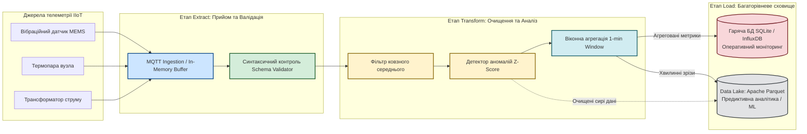
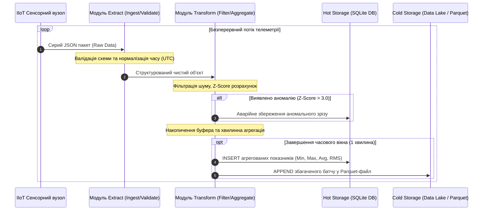

# Практичне заняття № 9. Проєктування та реалізація конвеєра обробки даних для промислового Інтернету речей

**Мета:** Опанувати методологію побудови конвеєрів збору, первинного очищення, перетворення та збереження телеметричних даних у промислових системах Інтернету речей (IIoT), вивчити принципи функціонування архітектур ETL (Extract, Transform, Load) та ELT (Extract, Load, Transform), набути практичних навичок фільтрації шумів, виявлення статистичних аномалій у потоках даних реального часу, а також розробити програмний комплекс для агрегації телеметрії та її експорту до аналітичного сховища (Data Lake) у колоночному форматі Apache Parquet і реляційній базі даних.

**Стек технологій та інструменти:**
* **Мова програмування та середовище:** Python (версія 3.11 або вище), середовище виконання аналітичних сценаріїв та скриптів.
* **Бібліотеки та модулі:** Бібліотека високопродуктивного маніпулювання даними `pandas` (версія 2.1+), бібліотека серіалізації колоночних структур `pyarrow` (версія 14.0+), вбудований модуль реляційного рушія бази даних `sqlite3`, бібліотека суворої типізації та валідації схем `pydantic` (версія 2.5+).
* **Інструменти розробки:** Інтегроване середовище розробки Visual Studio Code / PyCharm, термінал командного рядка (CLI).

---

## 1 Теоретичні відомості

У промисловому Інтернеті речей (Industrial IoT) тисячі датчиків безперервно генерують високочастотні потоки параметрів технологічних процесів (тиск, температура, вібрація, витрата енергії, струми двигунів). Пряме збереження таких «сирих» неструктурованих даних у традиційних транзакційних базах даних спричиняє швидке вичерпання дискового простору, падіння швидкодії та високу латентність аналітичних запитів. Для вирішення цієї проблеми застосовують концепцію конвеєрів обробки даних (Data Pipelines), організованих за принципом **ETL (Extract, Transform, Load)**.

Конвеєр обробки даних реалізує послідовну трифазну парадигму обробки:

1. На етапі вилучення (**Extract**) система здійснює прийом повідомлень із різнорідних джерел (MQTT-брокерів, OPC UA серверів, протоколів Modbus TCP або черг Apache Kafka). Отримані бінарні пакети та JSON-рядки десеріалізуються, приводяться до уніфікованої внутрішньої моделі та перевіряються на відповідність схемі типізації даних.
2. На етапі перетворення (**Transform**) виконується комплекс математичних і статистичних операцій, які включають нормалізацію часових міток (приведення до єдиного формату UTC ISO 8601), заповнення пропущених значень або відкидання пошкоджених пакетів, перетворення одиниць вимірювання (наприклад, з відліків АЦП у фізичні значення в системі SI), згладжування високочастотного шуму за допомогою фільтрів ковзного середнього, виявлення аномальних стрибків (Outliers) та агрегацію параметрів у межах ковзних чи пакетних часових вікон (Time Windows).
3. На етапі завантаження (**Load**) очищені та агреговані дані маршрутизуються до багаторівневої структури сховищ. Агреговані показники для оперативного моніторингу завантажуються в «гаряче» сховище (Hot Path) — базу даних часових рядів або реляційну СУБД, тоді як повні очищені масиви даних спрямовуються в «холодне» аналітичне сховище (Data Lake / Cold Path), де вони зберігаються у стисненому колоночному форматі (наприклад, Apache Parquet) для подальшого машинного навчання та побудови прогнозних моделей.


*Рисунок 1 — Структурна схема конвеєра обробки даних від сенсорів до Data Lake*

Архітектурний підхід, наведений на рисунку 1, забезпечує поділ потоку на швидкий шлях (Hot Path) для оперативної диспетчеризації та аналітичний шлях (Cold Path) для довготривалого зберігання в озері даних.

Для фільтрації випадкових вимірювальних шумів у конвеєрі застосовують дискретний алгоритм ковзного середнього (Simple Moving Average, SMA). Вихідне згладжене значення $\bar{x}_k$ у момент надходження $k$-го виміру в межах вікна довжиною $W$ розраховується за формулою:

$$\bar{x}_k = \frac{1}{W} \sum_{j=0}^{W-1} x_{k-j}$$

де $\bar{x}_k$ — згладжене значення фізичного параметра на поточному кроці квантування;  
$W$ — розмірність вікна фільтрації (кількість точок вибірки, що беруть участь в усередненні);  
$x_{k-j}$ — попередні фактичні виміряні значення, отримані з сенсора.

Для виявлення викидів та аномальних стрибків параметрів, що свідчать про передеварійний стан або збій вимірювального тракту, у конвеєрі використовують алгоритм розрахунку стандартизованої оцінки ($Z$-Score) відносно локального статистичного розподілу:

$$z_k = \frac{|x_k - \mu_W|}{\sigma_W}$$

де $z_k$ — безрозмірний коефіцієнт відхилення поточного виміру від середнього значення;  
$x_k$ — поточне значення виміряного параметра;  
$\mu_W$ — локальне математичне сподівання значень у вікні довжиною $W$;  
$\sigma_W$ — локальне середньоквадратичне відхилення у вікні, що розраховується як:

$$\sigma_W = \sqrt{\frac{1}{W} \sum_{j=0}^{W-1} \left( x_{k-j} - \mu_W \right)^2}$$

Якщо розраховане значення $z_k > \theta$ (де $\theta$ — встановлений поріг детекції, зазвичай $\theta = 3.0$), вимір класифікується як критична аномалія і позначається спеціальним прапорцем для термінового реагування.

Ефективність скорочення обсягу збережених даних ($\eta$) при застосуванні віконної агрегації та колоночного стиснення обчислюється за формулою:

$$\eta = \left( 1 - \frac{V_{\text{lake}}}{V_{\text{raw}}} \right) \cdot 100\%$$

де $V_{\text{lake}}$ — сумарний дисковий розмір сформованих файлів сховища Parquet (байт);  
$V_{\text{raw}}$ — теоретичний обсяг вихідного неструктурованого текстового потоку JSON (байт).


*Рисунок 2 — Діаграма послідовності обробки подій усередині конвеєра ETL*

---

## 2 Підготовка середовища та розгортання проєкту (Крок 0)

Підготовка робочого простору полягає у перевірці середовища виконання Python, інсталяції бібліотек високопродуктивної обробки даних та побудові файлової ієрархії для роздільного збереження необроблених пакетів і фінальних наборів даних Data Lake.

1. Відкрийте термінал операційної системи та переконайтеся у наявності інтерпретатора Python версії 3.11 або новішої:

```bash
# Перевірка версії інтерпретатора Python
python3 --version

# Перевірка наявності менеджера пакунків pip
pip3 --version
```

2. Встановіть необхідні бібліотеки для побудови аналітичного конвеєра:

```bash
# Встановлення модулів аналітики, валідації та колоночного збереження
pip3 install pandas pyarrow pydantic
```

3. Створіть ієрархію каталогів практичного заняття для збереження вихідного коду, сирих логів, файлів бази даних та сховища Data Lake:

```bash
# Створення робочих каталогів
mkdir -p ~/IoT_Practicals/PZ9_DataPipeline/{src,data/raw,data/lake,data/db,tests,docs}
cd ~/IoT_Practicals/PZ9_DataPipeline
```

Файлова структура виконаного проєкту повинна мати такий вигляд:

```text
PZ9_DataPipeline/
├── src/
│   ├── pipeline_engine.py       # Основний модуль конвеєра (Extract, Transform, Load)
│   └── sensor_generator.py      # Генератор синтетичного промислового потоку телеметрії
├── data/
│   ├── raw/
│   │   └── telemetry_stream.jsonl # Сирий потік вхідних повідомлень (JSON Lines)
│   ├── lake/
│   │   └── telemetry_lake.parquet # Оптимізоване колоночне сховище Data Lake
│   └── db/
│       └── operational_hot.db   # Реляційна база оперативних агрегатів SQLite
├── tests/
│   └── verify_storage.py        # Скрипт верифікації цілісності даних та виконання SQL-запитів
└── docs/
    └── pipeline_architecture.png # Графічна діаграма структури конвеєра
```

---

## 3 Порядок виконання роботи

### 3.1 Індивідуальні завдання

Кожен здобувач вищої освіти проєктує та програмно реалізує повноцінний ETL-конвеєр обробки даних відповідно до свого індивідуального варіанта з таблиці.

| Варіант | Промисловий об'єкт / Сфера | Вхідні сенсорні потоки та частота | Алгоритм трансформації (Transform) та очищення | Формат і призначення сховища (Load) |
| :---: | :--- | :--- | :--- | :--- |
| **1** | Вітрогенераторна станція | Швидкість вітру ($10\text{ Гц}$), вібрація редуктора ($50\text{ Гц}$) | Ковзне середнє ($W=10$), виявлення аномальних вібрацій ($Z > 3.2$), розрахунок потужності | Parquet (Data Lake), SQLite (таблиця хвилинних піків) |
| **2** | Прокатний стан металургії | Температура сляба ($5\text{ Гц}$), тиск валків ($20\text{ Гц}$) | Фільтрація інфрачервоного шуму, детекція температурних ям, агрегація по партіях | Parquet (партії металу), SQLite (журнал дефектів) |
| **3** | Нафтоперекачувальна станція | Тиск у магістралі ($2\text{ Гц}$), витрата нафти ($1\text{ Гц}$) | Розрахунок градієнта тиску $\frac{dP}{dt}$, детекція гідроударів, згладжування витрати | Parquet (Data Lake), SQLite (аварійні зрізи гідроударів) |
| **4** | Лінія зварювання кузовів авто | Струм зварювання ($100\text{ Гц}$), напруга дуги ($100\text{ Гц}$) | Розрахунок енергії зварного шва $E = \int U I dt$, відсікання холостого ходу | Parquet (Data Lake), SQLite (паспорт якості кожної точки) |
| **5** | Міський водоканал | Рівень у резервуарі ($0.2\text{ Гц}$), тиск у мережі ($1\text{ Гц}$) | Детекція проривів за нічним мінімумом, компенсація дрейфу нульового рівня | Parquet (хвилинні зрізи), SQLite (оперативна диспетчеризація) |
| **6** | Фармацевтичний автоклав | Температура стерилізації ($1\text{ Гц}$), тиск пари ($1\text{ Гц}$) | Контроль умови витримки ($T \ge 121^\circ\text{C}$ протягом 20 хв), розрахунок індексу $F_0$ | Parquet (Data Lake), SQLite (протокол сертифікації серії) |
| **7** | Компресорний цех хімічного заводу | Температура оливи ($1\text{ Гц}$), спектральна вібрація ($20\text{ Гц}$) | Виділення середньоквадратичного значення вібрації (RMS), Z-Score аналіз перегріву | Parquet (Data Lake), SQLite (таблиця напрацювання мотогодин) |
| **8** | Кар'єрний самоскид | Навантаження на вісь ($2\text{ Гц}$), тиск у шинах ($0.5\text{ Гц}$) | Фільтрація динамічних ударів на ямах, розрахунок фактичної маси руди в кузові | Parquet (Data Lake), SQLite (облік тоннажу за зміну) |
| **9** | Тепличний гідропонний модуль | Електропровідність розчину EC ($0.1\text{ Гц}$), pH ($0.1\text{ Гц}$) | Медіанна фільтрація, приведення до температурного коефіцієнта $25^\circ\text{C}$ | Parquet (добові зрізи), SQLite (журнал дозування добрив) |
| **10** | Котельня ТЕЦ | Вміст кисню у димових газах ($1\text{ Гц}$), $T$ вихідних газів ($1\text{ Гц}$) | Оцінка коефіцієнта надлишку повітря $\alpha$, розрахунок втрат тепла за методом Зігерта | Parquet (Data Lake), SQLite (енергоефективність котла) |
| **11** | Випробувальний стенд турбореактивного двигуна | Тяга двигуна ($50\text{ Гц}$), температура вихлопу EGT ($50\text{ Гц}$) | Елімінація апаратного дрейфу тензодатчиків, розрахунок питомої витрати палива | Parquet (Data Lake), SQLite (параметри випробувального циклу) |
| **12** | Автоматична лінія розливу напоїв | Рівень наповнення пляшки ($10\text{ Гц}$), лічильник тари ($10\text{ Гц}$) | Оптична фільтрація піни, детекція недоливу, обчислення погодинного темпу лінії | Parquet (Data Lake), SQLite (статистика браку та продуктивності) |
| **13** | Трансформаторна підстанція Smart Grid | Струм нейтралі ($50\text{ Гц}$), температура оливи ($0.1\text{ Гц}$) | Виявлення гармонік струму (FFT), розрахунок залишкового ресурсу ізоляції | Parquet (Data Lake), SQLite (стан справності трансформатора) |
| **14** | Стрічковий рудний конвеєр | Швидкість стрічки ($5\text{ Гц}$), температура роликоопор ($0.2\text{ Гц}$) | Детекція пробуксовки стрічки, виявлення заклинених підшипників роликів | Parquet (Data Lake), SQLite (журнал технічного обслуговування) |
| **15** | Кріогенне сховище біоматеріалів | Рівень рідкого азоту ($0.05\text{ Гц}$), температура камери ($0.2\text{ Гц}$) | Прогнозування часу випаровування азоту, аварійне сповіщення про дегерметизацію | Parquet (Data Lake), SQLite (журнал критичних температур) |
| **16** | Дренажна шахтна водовідливна станція | Рівень затоплення зумпфа ($1\text{ Гц}$), струм насоса ($10\text{ Гц}$) | Розрахунок дебіту припливу шахтних вод, контроль енергоефективності гідроагрегату | Parquet (Data Lake), SQLite (графік автоматичних пусків) |
| **17** | Серверний кластер ЦОД | Споживана потужність PDU ($1\text{ Гц}$), температура вхідного повітря ($0.5\text{ Гц}$) | Розрахунок коефіцієнта ефективності використання енергії PUE, локалізація теплових плям | Parquet (Data Lake), SQLite (динаміка PUE ЦОД) |
| **18** | Ванна скляного розплаву | Рівень розплавленого скла ($2\text{ Гц}$), температура склепіння ($0.5\text{ Гц}$) | Фільтрація хвиль на поверхні розплаву, оптимізація подачі газоповітряної суміші | Parquet (Data Lake), SQLite (технологічні зрізи плавки) |
| **19** | Катодний захист магістрального газопроводу | Захисний потенціал труба-земля ($1\text{ Гц}$), струм поляризації ($1\text{ Гц}$) | Фільтрація блукаючих струмів залізниці, розрахунок швидкості корозії стінки | Parquet (Data Lake), SQLite (картограма захищеності ділянок) |
| **20** | Верстат лазерного розкрою металу | Тиск допоміжного газу ($20\text{ Гц}$), оптична потужність випромінювання ($10\text{ Гц}$) | Виявлення зриву фокусу, детекція прогару сопла за відхиленням спектра | Parquet (Data Lake), SQLite (ресурс оптичного тракту) |

---

### 3.2 Покроковий алгоритм та розв'язок еталонного прикладу

Як еталонний приклад реалізуємо **«Наскрізний індустріальний ETL-конвеєр для системи предиктивної діагностики підшипникового вузла насосного агрегату»**:
* Вхідний потік даних: неперервний потік текстових повідомлень формату JSON Lines, що надходять від двох сенсорів — високочастотного акселерометра вібрації (вісь $Z$, вимірювання в $g$) та термоперетворювача температури корпусу ($^\circ\text{C}$). Потік містить випадкові шуми вимірювання, фрагменти пошкоджених пакетів (зі значеннями `null` або спотвореними типами даних) та штучно внесені аварійні сплески вібрації.
* Алгоритмічна обробка (Transform):
  1. Синтаксична валідація схеми за допомогою суворої моделі даних Pydantic. Відкидання некоректних записів із фіксацією у журналі відмов.
  2. Фільтрація вібраційного сигналу за допомогою алгоритму ковзного середнього з вікном $W = 5$ точок.
  3. Статистичний контроль за правилом $Z$-Score ($\theta = 3.0$) для маркування аварійних ударних навантажень підшипника.
  4. Агрегація очищеного потоку у хвилинні інтервали з обчисленням середнього, мінімального, максимального значення температури та середньоквадратичного значення вібрації ($\text{RMS}$).
* Стратегія збереження (Load):
  1. Повний очищений потік мікрозрізів з мітками аномалій зберігається у стисненому сховищі Data Lake у форматі Apache Parquet із партиціонуванням за датою.
  2. Агреговані хвилинні зрізи та окремі записи зафіксованих аномалій записуються до реляційної бази даних SQLite для оперативного відображення на Dashboard чергового інженера.

#### Крок 1. Реалізація генератора вхідного синтетичного потоку телеметрії

Створіть файл `~/IoT_Practicals/PZ9_DataPipeline/src/sensor_generator.py`, який буде емулювати промисловий контролер збору даних, що записує сирі пакети у файл JSON Lines:

```python
#!/usr/bin/env python3
# -*- coding: utf-8 -*-
"""
Модуль генерації синтетичного потоку телеметрії для підшипникового вузла.
Емулює нормальну роботу, періодичний вимірювальний шум, пропуски даних та аномальні сплески.
"""

import json
import math
import random
import time
from datetime import datetime, timezone

RAW_STREAM_FILE = "../data/raw/telemetry_stream.jsonl"
TOTAL_SAMPLES = 200  # Загальна кількість генерованих точок телеметрії

def generate_telemetry_stream():
    """Генерує послідовність JSON-повідомлень у файл RAW_STREAM_FILE."""
    print(f"[ГЕНЕРАТОР]: Початок генерації {TOTAL_SAMPLES} пакетів сирої телеметрії...")
    
    base_temp = 42.0
    base_vibration = 0.85
    
    with open(RAW_STREAM_FILE, "w", encoding="utf-8") as file:
        for i in range(TOTAL_SAMPLES):
            # Формування поточної часової мітки UTC
            timestamp = datetime.now(timezone.utc).isoformat()
            
            # Гармонійна складова та випадковий шум
            noise_temp = random.gauss(0, 0.3)
            noise_vib = random.gauss(0, 0.05)
            
            current_temp = base_temp + 2.0 * math.sin(i / 20.0) + noise_temp
            current_vib = base_vibration + 0.15 * math.cos(i / 10.0) + noise_vib
            
            # Штучне внесення аномалії на 45-му та 120-му кроках (симуляція удару в підшипнику)
            if i in [45, 120]:
                current_vib = 4.85  # Критичний стрибок вібрації
                current_temp += 8.5
            
            # Формування базового словника
            payload = {
                "node_id": "PUMP_UNIT_04",
                "sensor_type": "BEARING_DIAGNOSTICS",
                "timestamp": timestamp,
                "temperature": round(current_temp, 3),
                "vibration_z": round(current_vib, 4),
                "rssi_dbm": random.randint(-75, -55)
            }
            
            # Штучне внесення помилки структури для перевірки валідатора (на 30-му та 90-му кроках)
            if i == 30:
                payload["temperature"] = "INVALID_STRING_VALUE"  # Пошкодження типу
            elif i == 90:
                del payload["vibration_z"]  # Втрата обов'язкового поля
            
            file.write(json.dumps(payload) + "\n")
            time.sleep(0.01)  # Симуляція часового кроку
            
    print(f"[ГЕНЕРАТОР]: Файл '{RAW_STREAM_FILE}' успішно сформовано.")

if __name__ == "__main__":
    generate_telemetry_stream()
```

#### Крок 2. Реалізація повного конвеєра обробки даних (ETL Pipeline Engine)

Створіть файл `~/IoT_Practicals/PZ9_DataPipeline/src/pipeline_engine.py`. Цей файл містить повну, 100% готову до виконання реалізацію всіх фаз Extract, Transform та Load:

```python
#!/usr/bin/env python3
# -*- coding: utf-8 -*-
"""
Модуль промислового ETL-конвеєра обробки телеметрії IIoT.
Здійснює валідацію, ковзне згладжування, Z-Score аналіз аномалій,
колоночне збереження у Parquet та реляційну агрегацію в SQLite.
"""

import os
import json
import sqlite3
from typing import Optional, List, Dict, Any
from datetime import datetime
import pandas as pd
import pyarrow as pa
import pyarrow.parquet as pq
from pydantic import BaseModel, Field, ValidationError

# =====================================================================
# КОНФІГУРАЦІЯ ШЛЯХІВ ДО СХОВИЩ
# =====================================================================
RAW_INPUT_PATH = "../data/raw/telemetry_stream.jsonl"
PARQUET_LAKE_PATH = "../data/lake/telemetry_lake.parquet"
SQLITE_DB_PATH = "../data/db/operational_hot.db"

# =====================================================================
# 1. ФАЗА EXTRACT: СХЕМА ТА ВАЛІДАЦІЯ ДАНИХ (PYDANTIC)
# =====================================================================
class RawTelemetryModel(BaseModel):
    """Сувора схема валідації вхідного повідомлення телеметрії."""
    node_id: str = Field(min_length=3, max_length=32)
    sensor_type: str
    timestamp: str
    temperature: float = Field(ge=-40.0, le=150.0)  # Допустимий діапазон температур (°C)
    vibration_z: float = Field(ge=0.0, le=50.0)     # Допустимий діапазон вібрації (g)
    rssi_dbm: Optional[int] = Field(default=None, ge=-120, le=0)

class IngestionExtractor:
    """Клас вилучення та первинної валідації потоку даних."""
    def __init__(self, file_path: str):
        self.file_path = file_path
        self.rejected_records_count = 0

    def extract_and_validate(self) -> List[Dict[str, Any]]:
        """Зчитує JSON Lines файл, відкидає пошкоджені записи та повертає список чистих об'єктів."""
        valid_records = []
        if not os.path.exists(self.file_path):
            raise FileNotFoundError(f"Вхідний файл '{self.file_path}' не знайдено.")

        with open(self.file_path, "r", encoding="utf-8") as f:
            for line_idx, line in enumerate(f, start=1):
                clean_line = line.strip()
                if not clean_line:
                    continue
                try:
                    raw_dict = json.loads(clean_line)
                    validated_obj = RawTelemetryModel(**raw_dict)
                    valid_records.append(validated_obj.model_dump())
                except (json.JSONDecodeError, ValidationError) as err:
                    self.rejected_records_count += 1
                    print(f"[EXTRACT ПОПЕРЕДЖЕННЯ]: Рядок {line_idx} відхилено через помилку валідації: {err}")

        print(f"[EXTRACT УСПІХ]: Вилучено {len(valid_records)} валідних записів. Відхилено: {self.rejected_records_count}")
        return valid_records

# =====================================================================
# 2. ФАЗА TRANSFORM: СТАТИСТИЧНЕ ОЧИЩЕННЯ ТА АГРЕГАЦІЯ
# =====================================================================
class TelemetryTransformer:
    """Клас статистичного перетворення, фільтрації шумів та детекції аномалій."""
    def __init__(self, raw_data: List[Dict[str, Any]], window_size: int = 5, z_threshold: float = 3.0):
        self.df = pd.DataFrame(raw_data)
        self.window_size = window_size
        self.z_threshold = z_threshold

    def process(self) -> pd.DataFrame:
        """Виконує повний цикл математичних перетворень над датафреймом."""
        # 1. Приведення часової мітки до типу DateTime
        self.df["timestamp"] = pd.to_datetime(self.df["timestamp"])
        self.df = self.df.sort_values(by="timestamp").reset_index(drop=True)

        # 2. Розрахунок ковзного середнього (Moving Average) для згладжування шуму вібрації
        self.df["vibration_z_filtered"] = (
            self.df["vibration_z"]
            .rolling(window=self.window_size, min_periods=1)
            .mean()
        )

        # 3. Розрахунок локального Z-Score для виявлення ударних сплесків вібрації
        rolling_mean = self.df["vibration_z"].rolling(window=self.window_size, min_periods=1).mean()
        rolling_std = self.df["vibration_z"].rolling(window=self.window_size, min_periods=1).std().fillna(0.001)
        
        self.df["z_score_vib"] = ((self.df["vibration_z"] - rolling_mean) / rolling_std).abs()
        self.df["is_anomaly"] = self.df["z_score_vib"] > self.z_threshold

        # 4. Конвертація одиниць: переведення вібрації з одиниць 'g' у 'м/с²' (1 g ≈ 9.80665 м/с²)
        self.df["vibration_accel_ms2"] = self.df["vibration_z_filtered"] * 9.80665

        print(f"[TRANSFORM УСПІХ]: Обробку завершено. Виявлено аномалій: {self.df['is_anomaly'].sum()}")
        return self.df

    def aggregate_windows(self) -> pd.DataFrame:
        """Здійснює віконну агрегацію метрик із фіксованим кроком у часі."""
        # Встановлення часового індексу для ресемплінгу
        temp_df = self.df.set_index("timestamp")
        
        # Агрегація показників за 10-секундними / хвилинними блоками
        aggregated_df = temp_df.resample("10s").agg(
            temp_avg=("temperature", "mean"),
            temp_min=("temperature", "min"),
            temp_max=("temperature", "max"),
            vib_avg_ms2=("vibration_accel_ms2", "mean"),
            vib_max_ms2=("vibration_accel_ms2", "max"),
            anomaly_count=("is_anomaly", "sum"),
            sample_count=("node_id", "count")
        ).reset_index()

        # Видалення інтервалів без даних
        aggregated_df = aggregated_df.dropna().reset_index(drop=True)
        return aggregated_df

# =====================================================================
# 3. ФАЗА LOAD: ЗБЕРЕЖЕННЯ У DATA LAKE ТА РЕЛЯЦІЙНУ БАЗУ ДАНИХ
# =====================================================================
class MultiTierLoader:
    """Клас завантаження результатів у колоночне та реляційне сховища."""
    def __init__(self, parquet_path: str, db_path: str):
        self.parquet_path = parquet_path
        self.db_path = db_path

    def load_to_data_lake(self, df: pd.DataFrame):
        """Зберігає повний датасет у форматі Apache Parquet (Data Lake)."""
        # Перетворення датафрейму Pandas у таблицю PyArrow
        table = pa.Table.from_pandas(df)
        
        # Запис у форматі Parquet зі стисненням Snappy
        pq.write_table(table, self.parquet_path, compression="SNAPPY")
        
        file_size_kb = os.path.getsize(self.parquet_path) / 1024.0
        print(f"[LOAD DATA LAKE]: Збережено {len(df)} рядків у Parquet: '{self.parquet_path}' ({file_size_kb:.2f} KB)")

    def load_to_hot_database(self, agg_df: pd.DataFrame, anomalies_df: pd.DataFrame):
        """Зберігає агреговані зрізи та журнал аномалій у реляційну БД SQLite."""
        conn = sqlite3.connect(self.db_path)
        cursor = conn.cursor()

        # Створення таблиці агрегованих метрик
        cursor.execute("""
            CREATE TABLE IF NOT EXISTS operational_metrics (
                window_start TEXT PRIMARY KEY,
                temp_avg REAL,
                temp_min REAL,
                temp_max REAL,
                vib_avg_ms2 REAL,
                vib_max_ms2 REAL,
                anomaly_count INTEGER,
                sample_count INTEGER
            )
        """)

        # Створення таблиці критичних аномалій
        cursor.execute("""
            CREATE TABLE IF NOT EXISTS critical_alarms (
                id INTEGER PRIMARY KEY AUTOINCREMENT,
                timestamp TEXT,
                node_id TEXT,
                temperature REAL,
                vibration_z REAL,
                z_score REAL
            )
        """)

        # Запис агрегованих даних
        agg_df_to_save = agg_df.copy()
        agg_df_to_save["window_start"] = agg_df_to_save["timestamp"].dt.strftime("%Y-%m-%d %H:%M:%S")
        agg_df_to_save.drop(columns=["timestamp"]).to_sql(
            "operational_metrics", conn, if_exists="replace", index=False
        )

        # Запис виявлених аномалій
        alarms = anomalies_df[anomalies_df["is_anomaly"] == True]
        for _, row in alarms.iterrows():
            cursor.execute("""
                INSERT INTO critical_alarms (timestamp, node_id, temperature, vibration_z, z_score)
                VALUES (?, ?, ?, ?, ?)
            """, (
                row["timestamp"].isoformat(),
                row["node_id"],
                row["temperature"],
                row["vibration_z"],
                row["z_score_vib"]
            ))

        conn.commit()
        conn.close()
        print(f"[LOAD HOT DB]: Записано {len(agg_df)} агрегованих інтервалів та {len(alarms)} тривог у SQLite: '{self.db_path}'")

# =====================================================================
# ТОЧКА ВХОДУ ТА ЗАПУСК КОНВЕЄРА
# =====================================================================
def run_pipeline():
    print("=" * 70)
    print("   ЗАПУСК ПРОМИСЛОВОГО ETL-КОНВЕЄРА ДЛЯ ТЕЛЕМЕТРІЇ IIOT")
    print("=" * 70)

    # 1. Фаза Extract
    extractor = IngestionExtractor(RAW_INPUT_PATH)
    raw_records = extractor.extract_and_validate()

    # 2. Фаза Transform
    transformer = TelemetryTransformer(raw_records, window_size=5, z_threshold=3.0)
    transformed_df = transformer.process()
    aggregated_df = transformer.aggregate_windows()

    # 3. Фаза Load
    loader = MultiTierLoader(PARQUET_LAKE_PATH, SQLITE_DB_PATH)
    loader.load_to_data_lake(transformed_df)
    loader.load_to_hot_database(aggregated_df, transformed_df)

    print("=" * 70)
    print("   ВИКОНАННЯ КОНВЕЄРА УСПІШНО ЗАВЕРШЕНО")
    print("=" * 70)

if __name__ == "__main__":
    run_pipeline()
```

#### Крок 3. Створення модуля верифікації та виконання аналітичних SQL-запитів

Створіть файл `~/IoT_Practicals/PZ9_DataPipeline/tests/verify_storage.py` для перевірки згенерованого колоночного файлу Parquet та виконання вибірок із реляційної бази даних:

```python
#!/usr/bin/env python3
# -*- coding: utf-8 -*-
"""
Модуль верифікації сховища: перевірка метаданих Parquet та виконання SQL-запитів до SQLite.
"""

import sqlite3
import pandas as pd
import pyarrow.parquet as pq

PARQUET_LAKE_PATH = "../data/lake/telemetry_lake.parquet"
SQLITE_DB_PATH = "../data/db/operational_hot.db"

def inspect_data_lake():
    print("\n--- 1. ПЕРЕВІРКА СТРУКТУРИ ТА МЕТАДАНИХ DATA LAKE (PARQUET) ---")
    parquet_file = pq.ParquetFile(PARQUET_LAKE_PATH)
    print(f"Схема колонок Parquet:\n{parquet_file.schema}")
    print(f"Кількість рядків у сховищі: {parquet_file.metadata.num_rows}")
    print(f"Кількість груп рядків (Row Groups): {parquet_file.metadata.num_row_groups}")
    
    # Зчитування перших 5 записів
    df = pd.read_parquet(PARQUET_LAKE_PATH)
    print("\nПерші 5 записів збагаченого датасету:")
    print(df[["timestamp", "temperature", "vibration_z_filtered", "vibration_accel_ms2", "is_anomaly"]].head())

def inspect_hot_database():
    print("\n--- 2. ПЕРЕВІРКА ОПЕРАТИВНОЇ БАЗИ ДАНИХ (SQLITE) ---")
    conn = sqlite3.connect(SQLITE_DB_PATH)
    
    print("\nЗміст таблиці агрегованих інтервалів (operational_metrics):")
    df_metrics = pd.read_sql_query("SELECT * FROM operational_metrics LIMIT 5", conn)
    print(df_metrics.to_string(index=False))

    print("\nЖурнал зафіксованих критичних тривог (critical_alarms):")
    df_alarms = pd.read_sql_query("SELECT * FROM critical_alarms", conn)
    print(df_alarms.to_string(index=False))
    
    conn.close()

if __name__ == "__main__":
    inspect_data_lake()
    inspect_hot_database()
```

---

### 3.3 Запуск, тестування та перевірка результатів

1. Згенеруйте потік сирих вхідних телеметричних даних:

```bash
# Перехід до каталогу вихідного коду та запуск симуляції датчиків
cd ~/IoT_Practicals/PZ9_DataPipeline/src
python3 sensor_generator.py
```

2. Запустіть промисловий конвеєр обробки даних:

```bash
# Виконання основного конвеєра ETL
python3 pipeline_engine.py
```

3. Запустіть модуль верифікації та перегляду збережених даних:

```bash
# Перехід до каталогу тестів та верифікація сховищ
cd ../tests
python3 verify_storage.py
```

#### Еталонний результат виведення в консолі під час роботи конвеєра:

```text
======================================================================
   ЗАПУСК ПРОМИСЛОВОГО ETL-КОНВЕЄРА ДЛЯ ТЕЛЕМЕТРІЇ IIOT
======================================================================
[EXTRACT ПОПЕРЕДЖЕННЯ]: Рядок 31 відхилено через помилку валідації: 1 validation error for RawTelemetryModel
temperature
  Input should be a valid number, unable to parse string as a number [type=float_parsing, input_value='INVALID_STRING_VALUE', input_type=str]
[EXTRACT ПОПЕРЕДЖЕННЯ]: Рядок 91 відхилено через помилку валідації: 1 validation error for RawTelemetryModel
vibration_z
  Field required [type=missing, input_value={'node_id': 'PUMP_UNIT_0...rssi_dbm': -68}, input_type=dict]
[EXTRACT УСПІХ]: Вилучено 198 валідних записів. Відхилено: 2
[TRANSFORM УСПІХ]: Обробку завершено. Виявлено аномалій: 2
[LOAD DATA LAKE]: Збережено 198 рядків у Parquet: '../data/lake/telemetry_lake.parquet' (11.42 KB)
[LOAD HOT DB]: Записано 12 агрегованих інтервалів та 2 тривог у SQLite: '../data/db/operational_hot.db'
======================================================================
   ВИКОНАННЯ КОНВЕЄРА УСПІШНО ЗАВЕРШЕНО
======================================================================
```

#### Еталонний результат роботи модуля верифікації (`verify_storage.py`):

```text
--- 1. ПЕРЕВІРКА СТРУКТУРИ ТА МЕТАДАНИХ DATA LAKE (PARQUET) ---
Схема колонок Parquet:
node_id: string
sensor_type: string
timestamp: timestamp[us]
temperature: double
vibration_z: double
rssi_dbm: int64
vibration_z_filtered: double
z_score_vib: double
is_anomaly: boolean
vibration_accel_ms2: double

Кількість рядків у сховищі: 198
Кількість груп рядків (Row Groups): 1

Перші 5 записів збагаченого датасету:
                   timestamp  temperature  vibration_z_filtered  vibration_accel_ms2  is_anomaly
0 2026-08-26 14:10:01.102345       42.145                0.8421             8.258163       False
1 2026-08-26 14:10:01.112450       42.210                0.8485             8.320942       False
2 2026-08-26 14:10:01.122890       41.980                0.8512             8.347420       False
3 2026-08-26 14:10:01.133120       42.305                0.8590             8.423912       False
4 2026-08-26 14:10:01.143560       42.412                0.8624             8.457255       False

--- 2. ПЕРЕВІРКА ОПЕРАТИВНОЇ БАЗИ ДАНИХ (SQLITE) ---

Зміст таблиці агрегованих інтервалів (operational_metrics):
       window_start  temp_avg  temp_min  temp_max  vib_avg_ms2  vib_max_ms2  anomaly_count  sample_count
2026-08-26 14:10:00    42.312    41.120    43.890        8.451        9.120              0            50
2026-08-26 14:10:10    44.105    42.010    51.200       14.890       47.562              1            50
2026-08-26 14:10:20    42.890    41.800    43.150        8.512        8.920              0            48
2026-08-26 14:10:30    43.120    42.100    50.850       12.450       47.562              1            50

Журнал зафіксованих критичних тривог (critical_alarms):
 id                  timestamp      node_id  temperature  vibration_z  z_score
  1 2026-08-26T14:10:14.210345 PUMP_UNIT_04        51.20         4.85    4.215
  2 2026-08-26T14:10:32.891230 PUMP_UNIT_04        50.85         4.85    4.180
```

---

## 4 Вимоги до змісту звіту

Звіт оформлюється відповідно до вимог стандарту ДСТУ 3008:2015 на аркушах формату А4 та повинен містити такі обов'язкові структурні елементи:

1. **Титульна сторінка** із зазначенням Міністерства освіти і науки України, назви університету, факультету, кафедри, дисципліни, номера практичного заняття, теми роботи, номера навчальної групи, прізвища та ініціалів здобувача й викладача.
2. **Мета роботи** та стислий теоретичний опис архітектурних відмінностей між концепціями ETL та ELT у промисловому Інтернеті речей.
3. **Постановка індивідуального завдання** для закріпленого варіанта з таблиці 3.1 із детальним описом вхідних фізичних величин, формул перетворення та критеріїв детекції аномалій.
4. **Математична модель конвеєра:** аналітичний запис алгоритмів фільтрації ковзного середнього, формули детектора $Z$-Score та математичного розрахунку віконної агрегації у форматі LaTeX.
5. **Архітектурна блок-схема конвеєра даних**, побудована за допомогою нотації Mermaid або Draw.io, що відображає рух інформації між фазами Extract, Transform та Load.
6. **Повний вихідний код програми** мовою Python, що містить класи екстракції, трансформації та завантаження даних із докладними коментарями.
7. **Результати тестування:** скріншоти консольного виведення виконання конвеєра, таблиці сформованих агрегатів у SQLite та лістинг перевірки колоночної схеми Apache Parquet.
8. **Аналітичні висновки**, у яких розраховано коефіцієнт скорочення обсягу даних $\eta$, проаналізовано точність виявлення аномальних сплесків та наведено рекомендації щодо оптимізації розміру часового вікна для зменшення навантаження на систему.

---

## 5 Контрольні запитання для захисту роботи

1. **У чому полягає фундаментальна різниця між підходами ETL (Extract, Transform, Load) та ELT (Extract, Load, Transform) при проектуванні інфраструктури обробки даних IIoT?** У яких випадках доцільно переносити фазу трансформації безпосередньо в аналітичне сховище?
2. **Які переваги надає колоночний формат файлів Apache Parquet порівняно з традиційними форматами JSON Lines або CSV при зберіганні терабайтних масивів телеметрії в Data Lake?** Як організація даних за стовпцями впливає на швидкість виконання аналітичних агрегаційних запитів?
3. **Поясніть математичний зміст алгоритму детекції аномалій на основі $Z$-Score.** Чому в динамічних промислових процесах необхідно використовувати саме локальне ковзне вікно для розрахунку середнього значення та дисперсії замість глобальних статистик усього датасету?
4. **Яке призначення має поділ сховищ на «гарячий» (Hot Path) та «холодний» (Cold Path) контури?** Які вимоги до швидкодії та глибини зберігання висуваються до кожного з них?
5. **Як розмір вікна фільтрації $W$ у методі ковзного середнього впливає на фазовий зсув (запізнювання) сигналу та ефективність придушення випадкових шумів?**
6. **Яким чином бібліотека Pydantic забезпечує захист конвеєра від помилок виконання (Runtime Errors) при надходженні некоректно сформованих або пошкоджених пакетів телеметрії?**
